# Browser Lifecycle Management

This document details how PlaywrightAuthor manages the Chrome browser lifecycle from installation to connection management.

## Lifecycle Overview

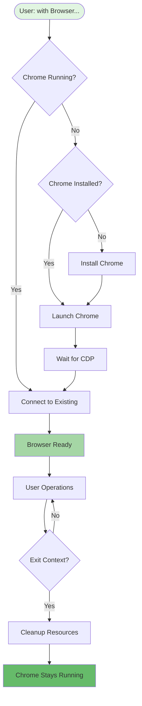

## Phase 1: Discovery & Installation

### Chrome Discovery Process

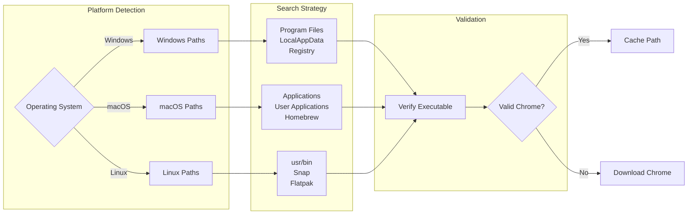

**Implementation**: `src/playwrightauthor/browser/finder.py`

The finder module:
1. Generates platform-specific search paths
2. Checks common installation locations
3. Validates executable permissions
4. Caches successful finds for performance

### Chrome Installation Process

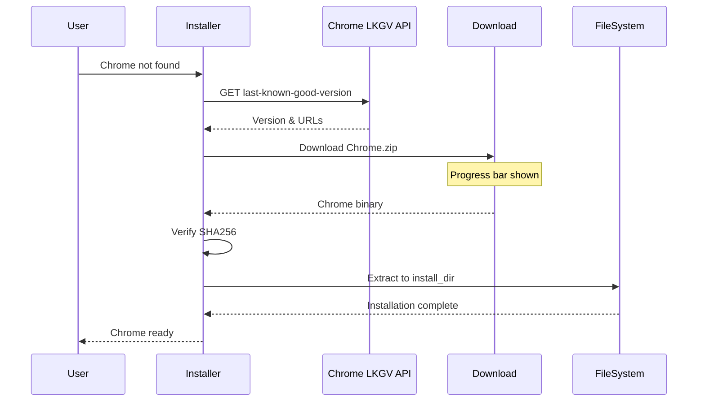

**Implementation**: `src/playwrightauthor/browser/installer.py`

Key features:
- Downloads from Google's official LKGV endpoint
- SHA256 integrity verification
- Progress reporting during download
- Atomic installation (no partial installs)

## Phase 2: Process Management

### Chrome Launch Sequence

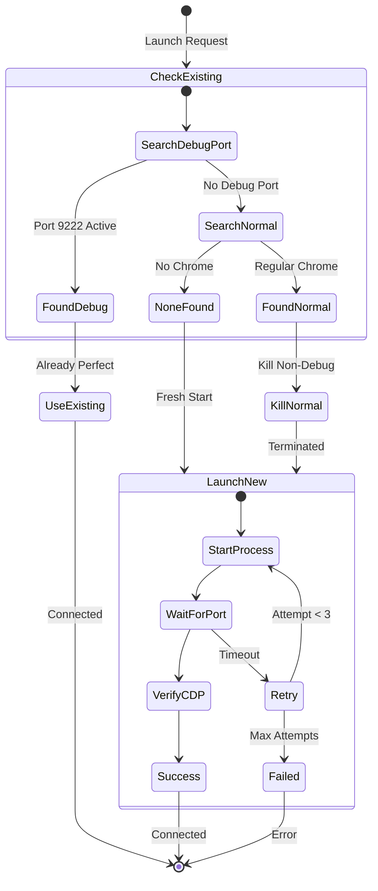

**Implementation**: `src/playwrightauthor/browser/launcher.py`

Launch arguments:
```python
args = [
    f"--remote-debugging-port={debug_port}",
    f"--user-data-dir={user_data_dir}",
    "--no-first-run",
    "--no-default-browser-check",
    "--disable-blink-features=AutomationControlled"
]
```

### Process Monitoring

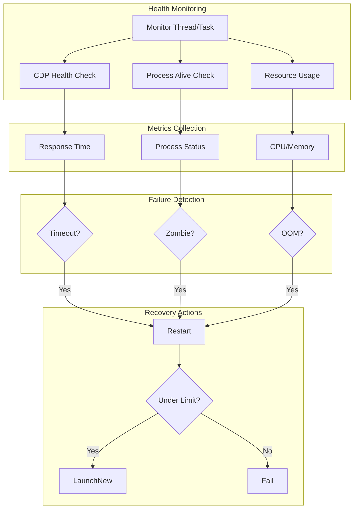

**Implementation**: `src/playwrightauthor/monitoring.py`

## Phase 3: Connection Management

### CDP Connection Flow

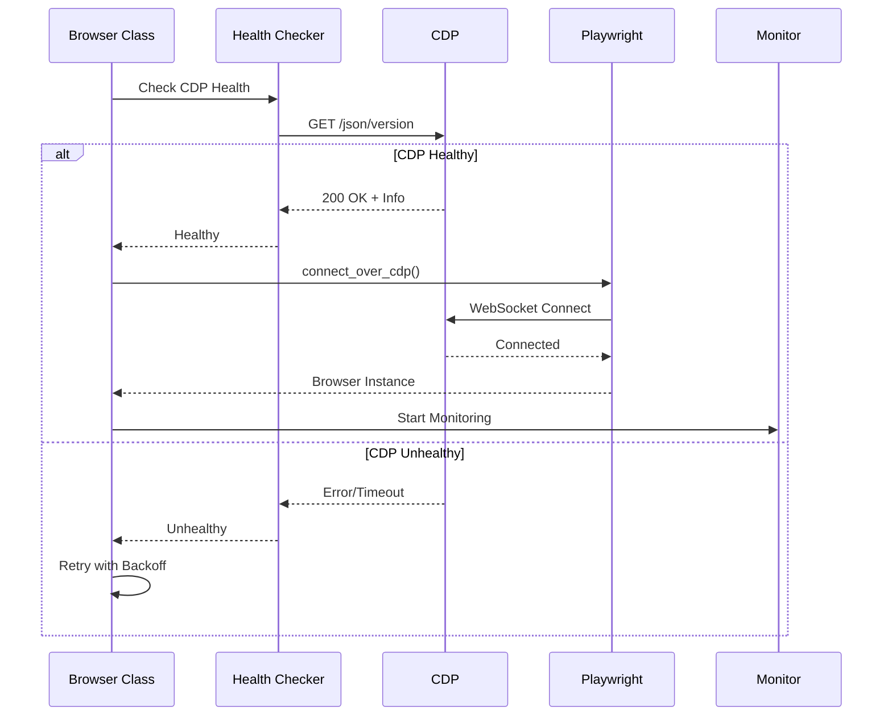

### Connection Retry Strategy

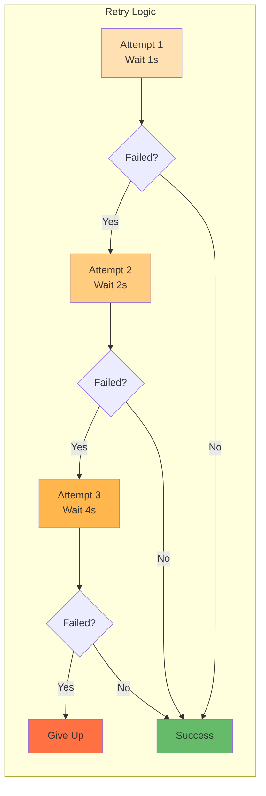

**Implementation**: `src/playwrightauthor/connection.py`

## Phase 4: State Persistence

### Profile Management

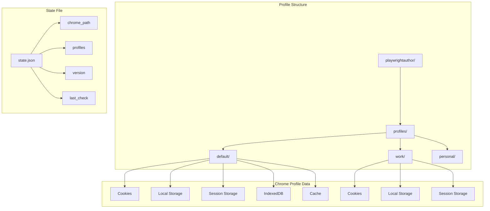

### Session Persistence Flow

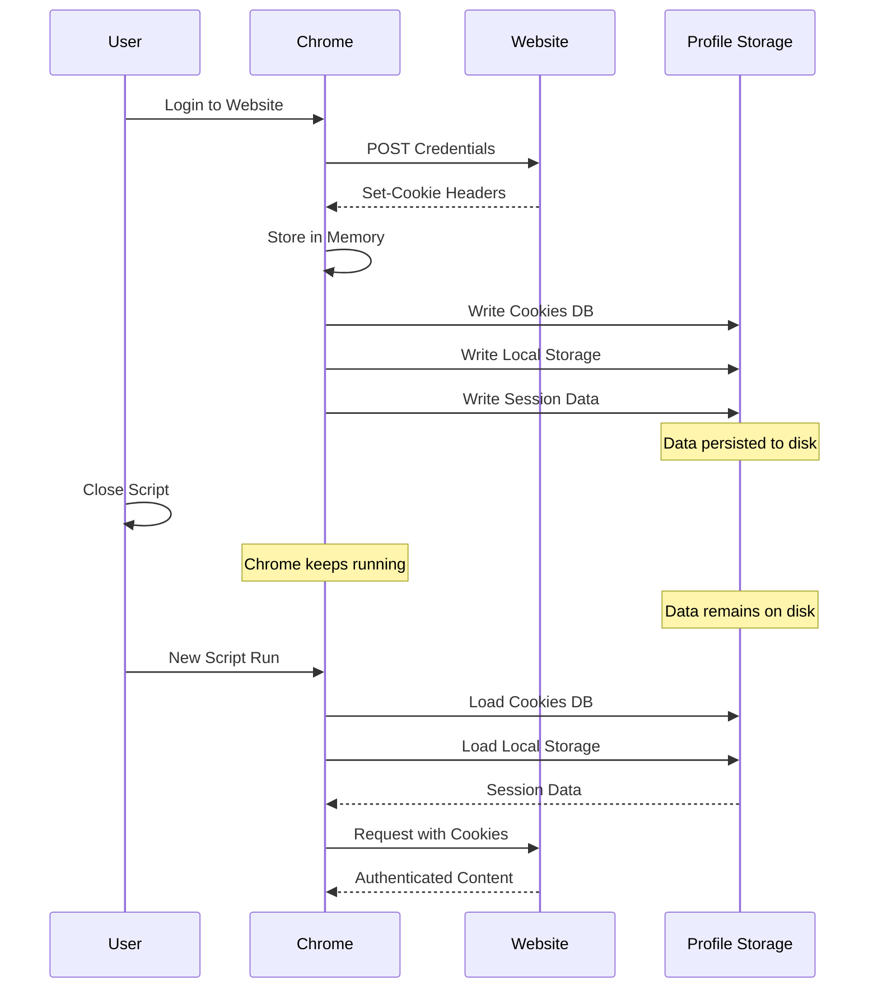

## Phase 5: Cleanup & Recovery

### Graceful Shutdown

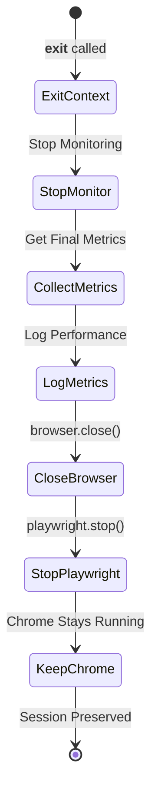

### Crash Recovery

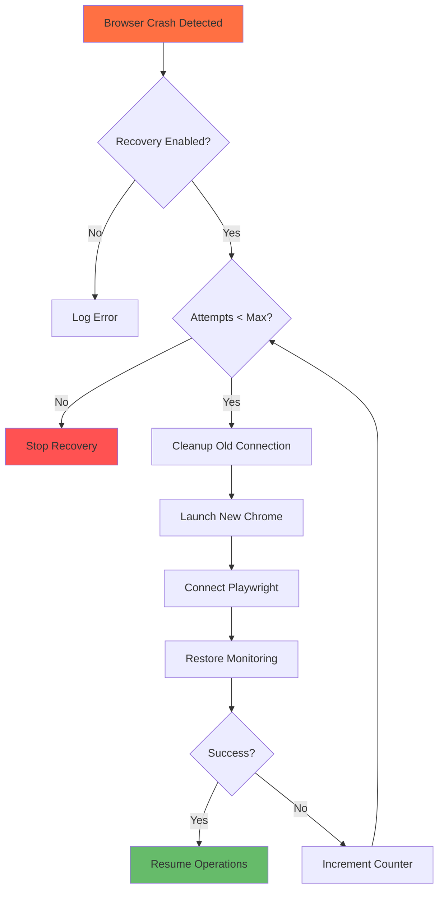

## Performance Considerations

### Connection Pooling (Future)

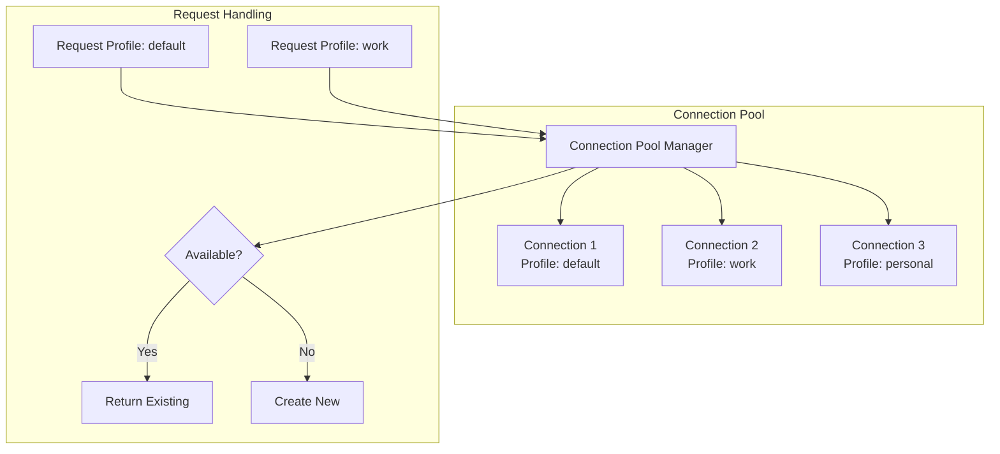

### Resource Management

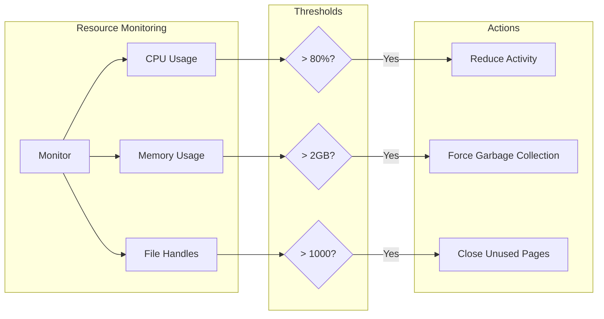

## Configuration Options

### Browser Launch Configuration

```python
# config.py settings that affect lifecycle
browser_config = {
    "debug_port": 9222,          # CDP port
    "headless": False,           # Show browser window
    "timeout": 30000,            # Launch timeout (ms)
    "viewport_width": 1280,      # Initial viewport
    "viewport_height": 720,
    "args": [],                  # Additional Chrome args
}

# Monitoring configuration  
monitoring_config = {
    "enabled": True,             # Enable health monitoring
    "check_interval": 30.0,      # Seconds between checks
    "enable_crash_recovery": True,
    "max_restart_attempts": 3,
}
```

### State Management Options

```python
# State persistence options
state_config = {
    "cache_chrome_path": True,   # Cache executable location
    "profile_isolation": True,   # Separate profile directories
    "state_version": 1,         # State schema version
}
```

## Additional Resources

- [Component Details](components.md)
- [Error Handling](error-handling.md)
- [Performance Guide](../performance/index.md)
- [Configuration Reference](../../api/config.md)