# Component Architecture

This document describes the components that make up PlaywrightAuthor's architecture.

## Core Components Overview

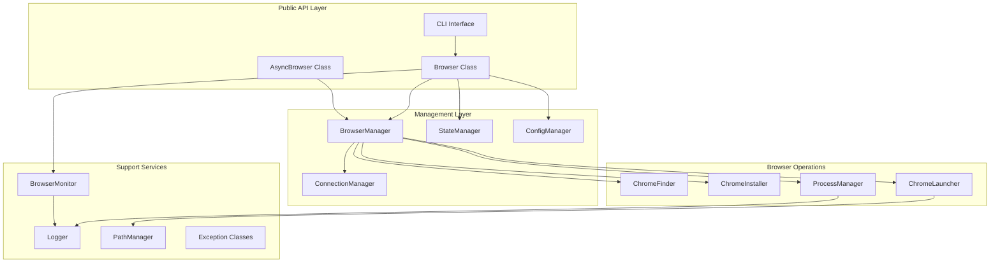

## Component Details

### 1. Browser & AsyncBrowser Classes
**Location**: `src/playwrightauthor/author.py`

Main entry points for users, implementing context managers for browser lifecycle management.

```python
# Sync API
class Browser:
    """Synchronous browser context manager."""
    
    def __init__(self, profile: str = "default", **kwargs):
        """Initialize with profile and optional config overrides."""
        
    def __enter__(self) -> PlaywrightBrowser:
        """Launch/connect browser and return Playwright Browser object."""
        
    def __exit__(self, exc_type, exc_val, exc_tb):
        """Cleanup resources but keep Chrome running."""

# Async API  
class AsyncBrowser:
    """Asynchronous browser context manager."""
    
    async def __aenter__(self) -> PlaywrightBrowser:
        """Async launch/connect browser."""
        
    async def __aexit__(self, exc_type, exc_val, exc_tb):
        """Async cleanup resources."""
```

**Features**:
- Profile-based session management
- Automatic Chrome installation
- Connection reuse
- Health monitoring integration
- Graceful error handling

### 2. BrowserManager
**Location**: `src/playwrightauthor/browser_manager.py`

Central orchestrator for browser operations.

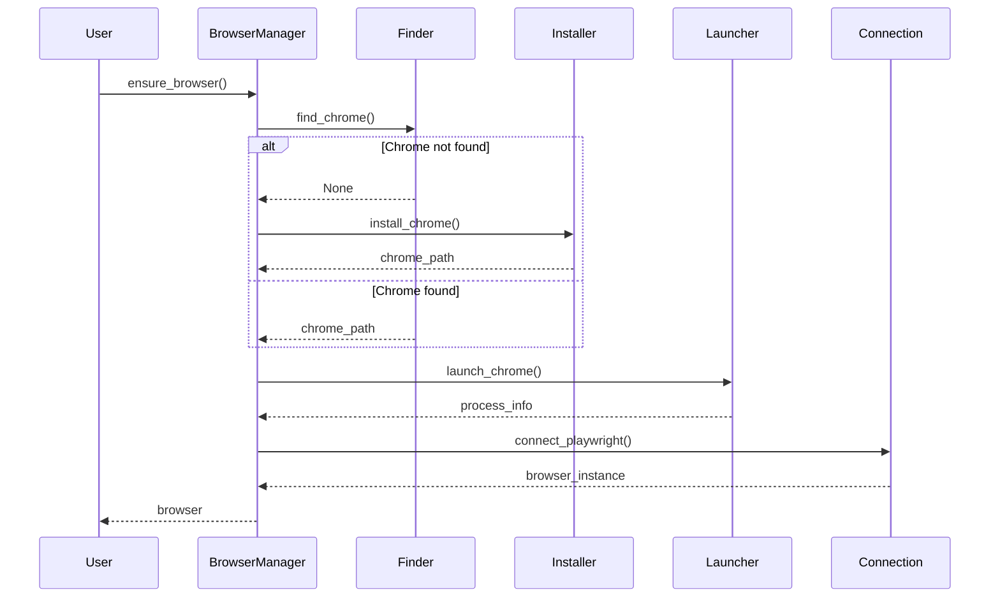

**Responsibilities**:
- Orchestrates browser discovery, installation, and launch
- Manages Chrome process lifecycle
- Handles connection establishment
- Coordinates with state manager

### 3. Configuration System
**Location**: `src/playwrightauthor/config.py`

Hierarchical configuration with sensible defaults.

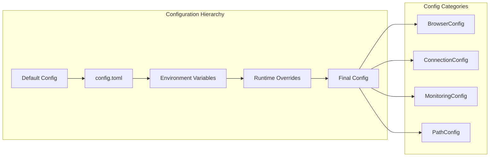

**Configuration Classes**:

```python
@dataclass
class BrowserConfig:
    """Browser launch configuration."""
    headless: bool = False
    debug_port: int = 9222
    viewport_width: int = 1280
    viewport_height: int = 720
    args: list[str] = field(default_factory=list)

@dataclass
class ConnectionConfig:
    """Connection settings."""
    timeout: int = 30000
    retry_attempts: int = 3
    retry_delay: float = 1.0
    health_check_timeout: int = 5000

@dataclass
class MonitoringConfig:
    """Health monitoring settings."""
    enabled: bool = True
    check_interval: float = 30.0
    enable_crash_recovery: bool = True
    max_restart_attempts: int = 3
```

### 4. State Management
**Location**: `src/playwrightauthor/state_manager.py`

Persistent state storage for browser information.

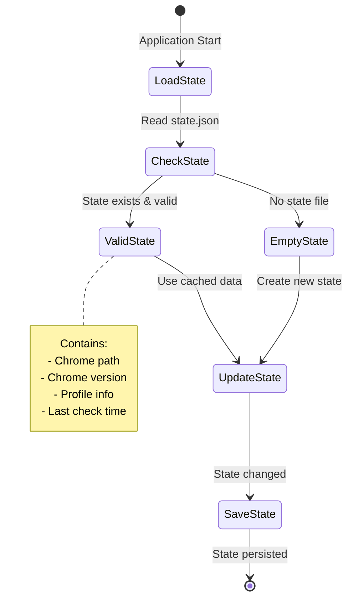

**State Structure**:
```json
{
    "version": 1,
    "chrome_path": "/path/to/chrome",
    "chrome_version": "120.0.6099.109",
    "last_check": "2024-01-20T10:30:00Z",
    "profiles": {
        "default": {
            "created": "2024-01-15T08:00:00Z",
            "last_used": "2024-01-20T10:30:00Z"
        }
    }
}
```

### 5. Browser Operations

#### ChromeFinder
**Location**: `src/playwrightauthor/browser/finder.py`

Platform-specific Chrome discovery logic.

```mermaid
graph TD
    subgraph "Platform Detection"
        Start[find_chrome_executable]
        OS{Operating System}
        
        Start --> OS
        OS -->|Windows| WinPaths[Windows Paths]
        OS -->|macOS| MacPaths[macOS Paths]
        OS -->|Linux| LinuxPaths[Linux Paths]
    end
    
    subgraph "Search Strategy"
        WinPaths --> WinSearch[Registry + Program Files]
        MacPaths --> MacSearch[Applications + Homebrew]
        LinuxPaths --> LinSearch[/usr/bin + Snap + Flatpak]
    end
    
    subgraph "Validation"
        WinSearch --> Validate[Verify Executable]
        MacSearch --> Validate
        LinSearch --> Validate
        
        Validate --> Found{Valid Chrome?}
        Found -->|Yes| Return[Return Path]
        Found -->|No| NotFound[Return None]
    end
```

**Search Locations**:
- **Windows**: Registry, Program Files, LocalAppData
- **macOS**: /Applications, ~/Applications, Homebrew
- **Linux**: /usr/bin, Snap packages, Flatpak, AppImage

#### ChromeInstaller
**Location**: `src/playwrightauthor/browser/installer.py`

Downloads and installs Chrome for Testing.

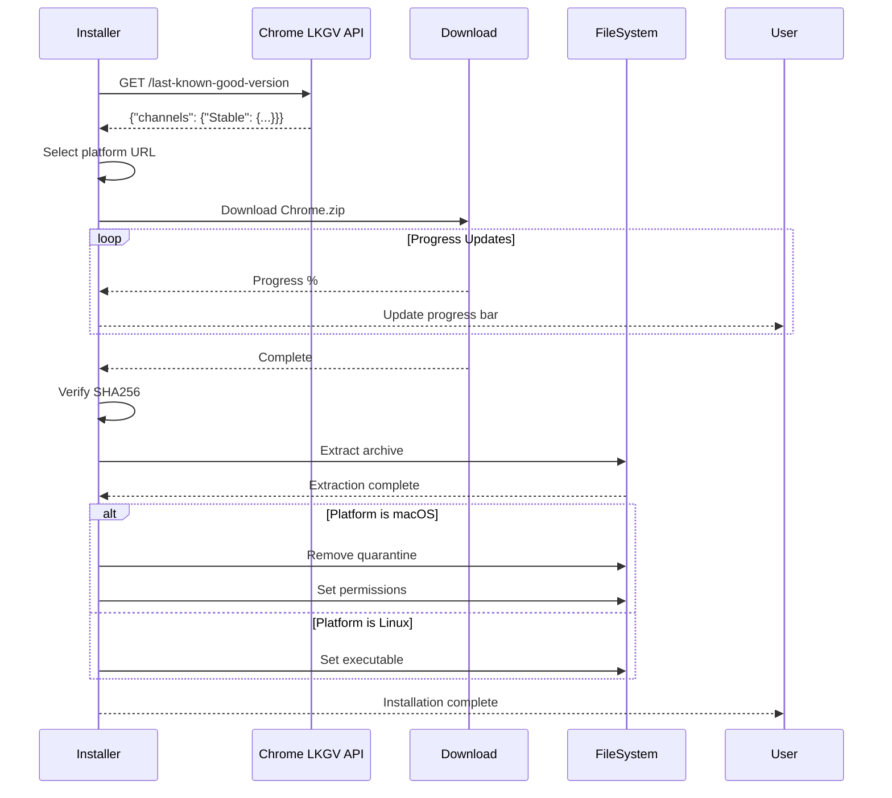

#### ChromeLauncher
**Location**: `src/playwrightauthor/browser/launcher.py`

Manages Chrome process launch with proper arguments.

**Launch Arguments**:
```python
CHROME_ARGS = [
    f"--remote-debugging-port={debug_port}",
    f"--user-data-dir={user_data_dir}",
    "--no-first-run",
    "--no-default-browser-check",
    "--disable-blink-features=AutomationControlled",
    "--disable-component-extensions-with-background-pages",
    "--disable-background-networking",
    "--disable-background-timer-throttling",
    "--disable-backgrounding-occluded-windows",
    "--disable-renderer-backgrounding",
    "--disable-features=TranslateUI",
    "--disable-ipc-flooding-protection",
    "--enable-features=NetworkService,NetworkServiceInProcess"
]
```

#### ProcessManager
**Location**: `src/playwrightauthor/browser/process.py`

Handles process lifecycle and monitoring.

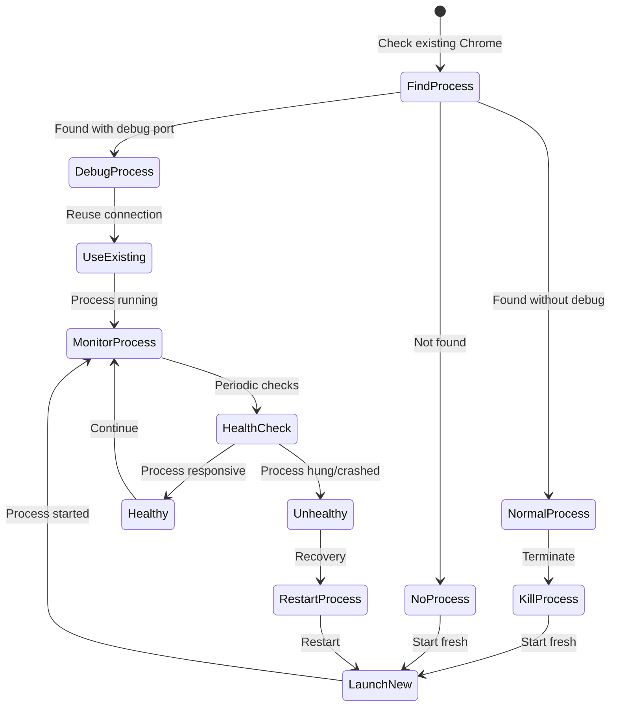

### 6. Connection Management
**Location**: `src/playwrightauthor/connection.py`

Handles CDP connection establishment and health checks.

```python
class ConnectionManager:
    """Manages Chrome DevTools Protocol connections."""
    
    def connect_playwright(self, endpoint_url: str) -> Browser:
        """Establish Playwright connection to Chrome."""
        
    def check_health(self) -> ConnectionHealth:
        """Verify CDP endpoint is responsive."""
        
    def wait_for_ready(self, timeout: int) -> bool:
        """Wait for Chrome to be ready for connections."""
```

**Health Check Flow**:
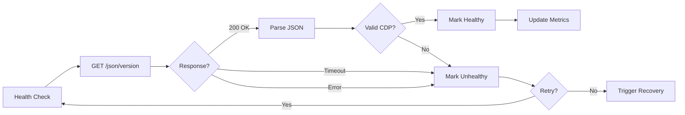

### 7. Monitoring System
**Location**: `src/playwrightauthor/monitoring.py`

Production-grade health monitoring and recovery.

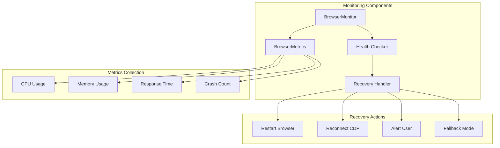

**Monitoring Features**:
- Periodic health checks
- Resource usage tracking
- Crash detection and recovery
- Performance metrics collection
- Configurable thresholds
- Automatic restart with backoff

### 8. CLI Interface
**Location**: `src/playwrightauthor/cli.py`

Fire-powered command-line interface.

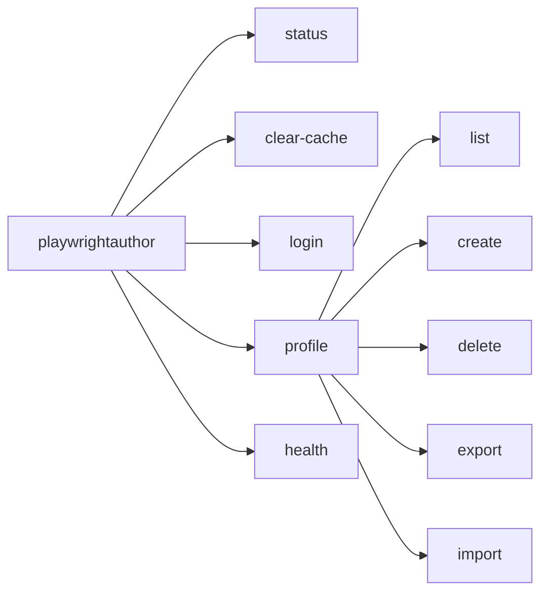

**Command Examples**:
```bash
# Check browser status
playwrightauthor status

# Clear cache but keep profiles
playwrightauthor clear-cache --keep-profiles

# Manage profiles
playwrightauthor profile list
playwrightauthor profile create work
playwrightauthor profile export default backup.zip

# Interactive login
playwrightauthor login github
```

### 9. Exception Hierarchy
**Location**: `src/playwrightauthor/exceptions.py`

Structured exception handling with user guidance.

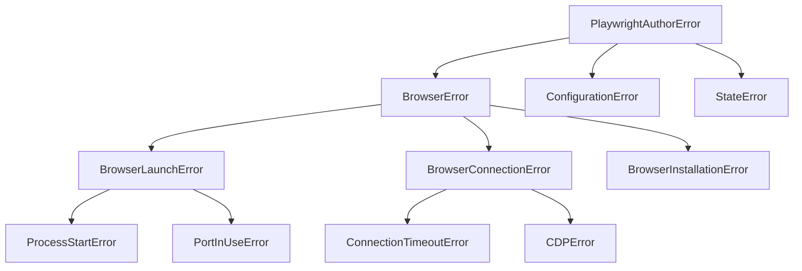

**Exception Features**:
- User-friendly error messages
- Suggested solutions
- Diagnostic information
- Recovery actions

### 10. Utility Components

#### Logger
**Location**: `src/playwrightauthor/utils/logger.py`

Loguru-based logging with rich formatting.

```python
def configure(verbose: bool = False) -> Logger:
    """Configure application logger."""
    logger.remove()  # Remove default handler
    
    if verbose:
        level = "DEBUG"
        format = "<green>{time:HH:mm:ss}</green> | <level>{level: <8}</level> | <cyan>{name}</cyan>:<cyan>{line}</cyan> - <level>{message}</level>"
    else:
        level = "INFO"
        format = "<green>{time:HH:mm:ss}</green> | <level>{message}</level>"
    
    logger.add(sys.stderr, format=format, level=level)
    return logger
```

#### PathManager
**Location**: `src/playwrightauthor/utils/paths.py`

Cross-platform path resolution using platformdirs.

```python
def data_dir() -> Path:
    """Get platform-specific data directory."""
    # Windows: %LOCALAPPDATA%\playwrightauthor
    # macOS: ~/Library/Application Support/playwrightauthor
    # Linux: ~/.local/share/playwrightauthor
    
def cache_dir() -> Path:
    """Get platform-specific cache directory."""
    # Windows: %LOCALAPPDATA%\playwrightauthor\Cache
    # macOS: ~/Library/Caches/playwrightauthor
    # Linux: ~/.cache/playwrightauthor
```

## Component Interactions

### Startup Sequence

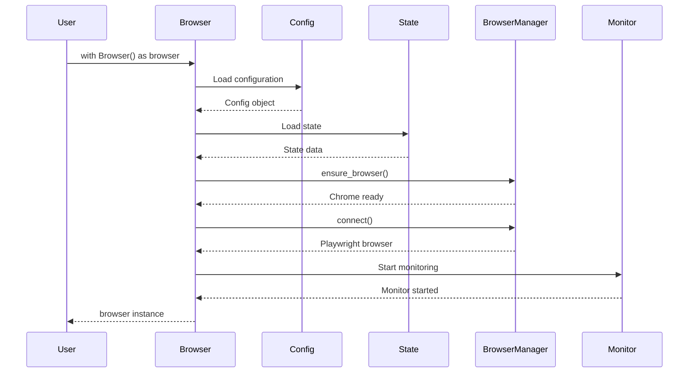

### Error Recovery Flow

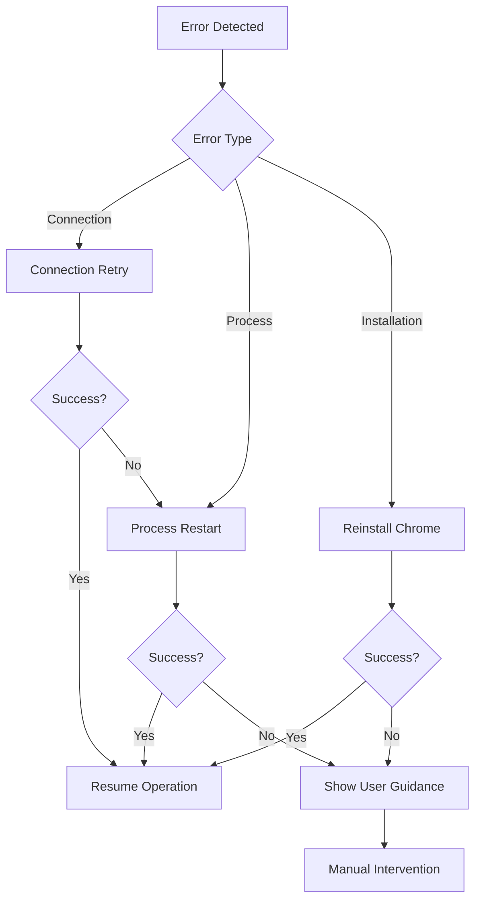

## Design Patterns

### 1. **Context Manager Pattern**
Used for automatic resource management:
```python
with Browser() as browser:
    # Browser is ready
    pass
# Chrome keeps running after exit
```

### 2. **Factory Pattern**
BrowserManager acts as a factory for browser instances.

### 3. **Strategy Pattern**
Platform-specific implementations for Chrome discovery.

### 4. **Observer Pattern**
Health monitoring observes browser state changes.

### 5. **Singleton Pattern**
Configuration and state managers are singletons.

## Performance Characteristics

### Memory Usage
- Base library: ~50MB
- Per browser instance: ~200MB
- Per page: ~50-100MB
- Monitoring overhead: ~10MB

### Startup Times
- Cold start (with download): 30-60s
- Cold start (Chrome installed): 2-5s
- Warm start (Chrome running): 0.5-1s
- With monitoring: +0.1s

### Connection Reliability
- Retry attempts: 3 (configurable)
- Backoff strategy: Exponential
- Health check interval: 30s (configurable)
- Recovery time: <5s typical

## Security Considerations

### Profile Isolation
Each profile maintains separate:
- Cookies and session storage
- Cache and local storage
- Extension data
- Browsing history

### Process Security
- Chrome runs with minimal privileges
- Separate user data directories
- No shared state between profiles
- Secure IPC via CDP

### Future: Encryption
- Profile data encryption at rest
- Secure credential storage
- Key derivation from user password
- Automatic lock on idle

## Additional Resources

- [Browser Lifecycle](browser-lifecycle.md)
- [Error Handling](error-handling.md)
- [API Reference](../../api/index.md)
- [Configuration Guide](../configuration/index.md)
- [Performance Tuning](../performance/optimization.md)