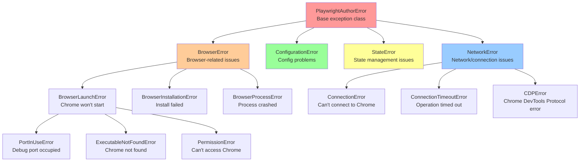
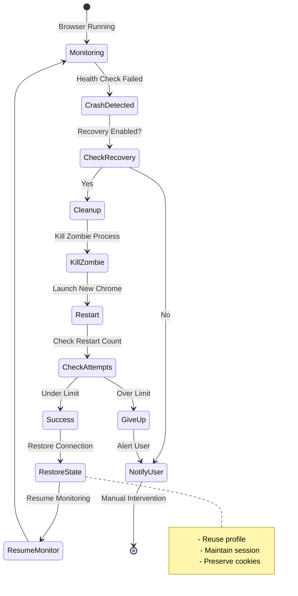
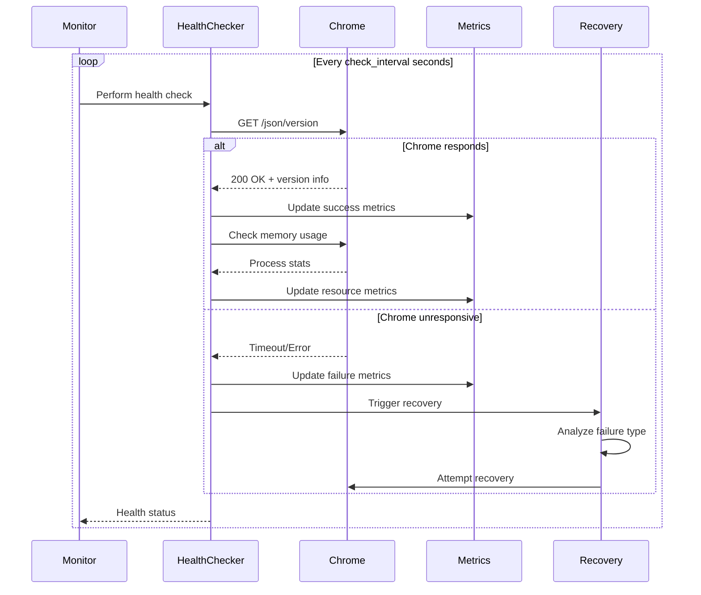
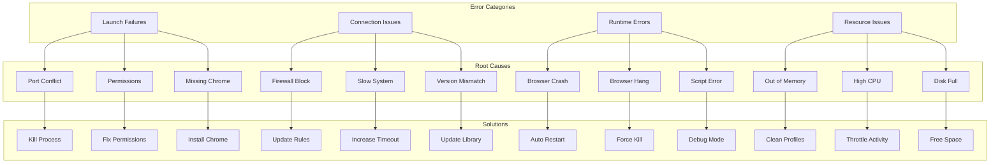

# Error Handling & Recovery

This document details PlaywrightAuthor's error handling system, recovery mechanisms, and user guidance features.

## Error Handling Philosophy

PlaywrightAuthor follows these principles for error handling:

1. **Fail Gracefully**: Never leave the system in a bad state
2. **Guide Users**: Provide clear, actionable error messages
3. **Auto-Recover**: Attempt automatic recovery when safe
4. **Preserve Data**: Never lose user sessions or data
5. **Learn & Adapt**: Use errors to improve future reliability

## Exception Hierarchy



## Exception Details

### Base Exception

```python
class PlaywrightAuthorError(Exception):
    """Base exception with user guidance."""
    
    def __init__(
        self, 
        message: str,
        suggestion: str = None,
        diagnostic_info: dict = None
    ):
        self.message = message
        self.suggestion = suggestion
        self.diagnostic_info = diagnostic_info or {}
        super().__init__(self._format_message())
    
    def _format_message(self) -> str:
        """Format exception with guidance."""
        parts = [f"Error: {self.message}"]
        
        if self.suggestion:
            parts.append(f"\nSuggestion: {self.suggestion}")
        
        if self.diagnostic_info:
            parts.append("\nDiagnostic Info:")
            for key, value in self.diagnostic_info.items():
                parts.append(f"   {key}: {value}")
        
        return "\n".join(parts)
```

### Browser Launch Errors

```python
class BrowserLaunchError(BrowserError):
    """Failed to launch Chrome browser."""
    
    @staticmethod
    def port_in_use(port: int) -> "BrowserLaunchError":
        return BrowserLaunchError(
            f"Port {port} is already in use",
            suggestion=(
                f"1. Kill existing Chrome: pkill -f 'chrome.*--remote-debugging-port={port}'\n"
                f"2. Use different port: Browser(debug_port=9333)\n"
                f"3. Let PlaywrightAuthor handle it: Browser(kill_existing=True)"
            ),
            diagnostic_info={
                "port": port,
                "process_check": "ps aux | grep chrome"
            }
        )
    
    @staticmethod
    def executable_not_found(search_paths: list[str]) -> "BrowserLaunchError":
        return BrowserLaunchError(
            "Chrome executable not found",
            suggestion=(
                "1. Let PlaywrightAuthor install it: playwrightauthor install\n"
                "2. Install manually: https://googlechromelabs.github.io/chrome-for-testing/\n"
                "3. Specify path: Browser(chrome_path='/path/to/chrome')"
            ),
            diagnostic_info={
                "searched_paths": search_paths,
                "platform": platform.system()
            }
        )
```

### Connection Errors

```python
class ConnectionTimeoutError(NetworkError):
    """Connection to Chrome timed out."""
    
    @staticmethod
    def cdp_timeout(endpoint: str, timeout: int) -> "ConnectionTimeoutError":
        return ConnectionTimeoutError(
            f"Chrome DevTools Protocol connection timed out",
            suggestion=(
                "1. Check if Chrome is running: ps aux | grep chrome\n"
                "2. Verify CDP endpoint: curl http://localhost:9222/json/version\n"
                "3. Increase timeout: Browser(connection_timeout=60000)\n"
                "4. Check firewall/antivirus settings"
            ),
            diagnostic_info={
                "endpoint": endpoint,
                "timeout_ms": timeout,
                "diagnostic_url": f"{endpoint}/json/version"
            }
        )
```

## Retry Mechanisms

### Connection Retry Strategy

```mermaid
flowchart TD
    Connect[Initial Connection] --> Check{Success?}
    Check -->|Yes| Success[Return Browser]
    Check -->|No| Retry{Retry Count < Max?}
    
    Retry -->|Yes| Wait[Wait with Backoff]
    Retry -->|No| Fail[Raise Exception]
    
    Wait --> Calculate[Calculate Delay]
    Calculate --> Delay1[Attempt 1: 1s]
    Calculate --> Delay2[Attempt 2: 2s]
    Calculate --> Delay3[Attempt 3: 4s]
    Calculate --> DelayN[Attempt N: 2^(N-1)s]
    
    Delay1 --> Connect
    Delay2 --> Connect
    Delay3 --> Connect
    DelayN --> Connect
    
    style Success fill:#90EE90
    style Fail fill:#FFB6C1
```

### Implementation

```python
class RetryStrategy:
    """Configurable retry with exponential backoff."""
    
    def __init__(
        self,
        max_attempts: int = 3,
        base_delay: float = 1.0,
        max_delay: float = 60.0,
        exponential_base: float = 2.0
    ):
        self.max_attempts = max_attempts
        self.base_delay = base_delay
        self.max_delay = max_delay
        self.exponential_base = exponential_base
    
    def execute(self, operation: Callable, *args, **kwargs):
        """Execute operation with retries."""
        last_error = None
        
        for attempt in range(1, self.max_attempts + 1):
            try:
                return operation(*args, **kwargs)
            except RetriableError as e:
                last_error = e
                
                if attempt < self.max_attempts:
                    delay = self.calculate_delay(attempt)
                    logger.warning(
                        f"Attempt {attempt}/{self.max_attempts} failed: {e}. "
                        f"Retrying in {delay:.1f}s..."
                    )
                    time.sleep(delay)
        
        raise last_error
    
    def calculate_delay(self, attempt: int) -> float:
        """Calculate exponential backoff delay."""
        delay = self.base_delay * (self.exponential_base ** (attempt - 1))
        return min(delay, self.max_delay)
```

## Recovery Mechanisms

### Browser Crash Recovery



### Recovery Implementation

```python
class BrowserRecovery:
    """Automatic browser crash recovery."""
    
    def __init__(self, config: RecoveryConfig):
        self.config = config
        self.restart_count = 0
        self.last_restart = None
    
    async def handle_crash(self, error: Exception) -> Browser:
        """Handle browser crash with automatic recovery."""
        logger.error(f"Browser crash detected: {error}")
        
        # Check if recovery is enabled
        if not self.config.enable_crash_recovery:
            raise BrowserCrashError(
                "Browser crashed and automatic recovery is disabled",
                suggestion="Enable recovery: Browser(enable_crash_recovery=True)"
            )
        
        # Check restart limits
        if self.restart_count >= self.config.max_restart_attempts:
            raise BrowserCrashError(
                f"Browser crashed {self.restart_count} times, giving up",
                suggestion=(
                    "1. Check system resources: free -h\n"
                    "2. Review Chrome logs: ~/.config/google-chrome/chrome_debug.log\n"
                    "3. Try different Chrome version\n"
                    "4. Report issue: https://github.com/twardoch/playwrightauthor/issues"
                )
            )
        
        # Implement restart cooldown
        if self.last_restart:
            cooldown = self.config.restart_cooldown
            elapsed = time.time() - self.last_restart
            if elapsed < cooldown:
                wait_time = cooldown - elapsed
                logger.info(f"Waiting {wait_time:.1f}s before restart...")
                await asyncio.sleep(wait_time)
        
        # Attempt recovery
        try:
            logger.info(f"Attempting browser restart ({self.restart_count + 1}/{self.config.max_restart_attempts})...")
            
            # Clean up crashed process
            await self._cleanup_crashed_browser()
            
            # Restart browser
            new_browser = await self._restart_browser()
            
            self.restart_count += 1
            self.last_restart = time.time()
            
            logger.success("Browser recovered successfully!")
            return new_browser
            
        except Exception as e:
            logger.error(f"Recovery failed: {e}")
            raise
```

## User Guidance System

### Intelligent Error Messages

```python
class UserGuidance:
    """Provides contextual help for errors."""
    
    ERROR_GUIDANCE = {
        "permission_denied": {
            "windows": [
                "Run as Administrator",
                "Check Windows Defender settings",
                "Add to antivirus exclusions"
            ],
            "macos": [
                "Grant Terminal permissions in System Preferences",
                "Run: sudo xattr -cr /path/to/chrome",
                "Check Gatekeeper settings"
            ],
            "linux": [
                "Check file permissions: ls -la",
                "Run: chmod +x chrome",
                "Check AppArmor/SELinux policies"
            ]
        },
        "network_error": [
            "Check internet connection",
            "Verify proxy settings",
            "Try: curl http://localhost:9222/json/version",
            "Check firewall rules"
        ],
        "profile_corruption": [
            "Clear profile: playwrightauthor clear-cache",
            "Create new profile: Browser(profile='fresh')",
            "Backup and restore: playwrightauthor profile export/import"
        ]
    }
    
    @classmethod
    def get_guidance(cls, error_type: str, platform: str = None) -> list[str]:
        """Get platform-specific guidance."""
        guidance = cls.ERROR_GUIDANCE.get(error_type, [])
        
        if isinstance(guidance, dict) and platform:
            return guidance.get(platform.lower(), [])
        
        return guidance if isinstance(guidance, list) else []
```

### Interactive Error Resolution

```python
def interactive_error_handler(error: PlaywrightAuthorError):
    """Guide user through error resolution."""
    console = Console()
    
    # Display error
    console.print(f"\nError: {error.message}")
    
    if error.suggestion:
        console.print(f"\nSuggestion:")
        console.print(error.suggestion)
    
    # Offer automated fixes
    if hasattr(error, 'auto_fix_available'):
        if Confirm.ask("\nWould you like to try automatic fix?"):
            try:
                error.auto_fix()
                console.print("Fixed automatically!")
                return True
            except Exception as e:
                console.print(f"Auto-fix failed: {e}")
    
    # Interactive troubleshooting
    if hasattr(error, 'troubleshooting_steps'):
        console.print("\nTroubleshooting Steps:")
        
        for i, step in enumerate(error.troubleshooting_steps, 1):
            console.print(f"{i}. {step['description']}")
            
            if step.get('check_command'):
                result = run_diagnostic(step['check_command'])
                console.print(f"   Result: {result}")
            
            if step.get('requires_input'):
                user_input = Prompt.ask(f"   {step['prompt']}")
                step['handler'](user_input)
    
    return False
```

## Health Check System

### Health Check Flow



### Health Metrics

```python
@dataclass
class HealthMetrics:
    """Browser health metrics."""
    last_check_time: float
    last_success_time: float
    consecutive_failures: int
    total_checks: int
    success_rate: float
    average_response_time: float
    memory_usage_mb: float
    cpu_percent: float
    
    def is_healthy(self) -> bool:
        """Determine if browser is healthy."""
        return (
            self.consecutive_failures < 3 and
            self.success_rate > 0.9 and
            self.average_response_time < 1000 and
            self.memory_usage_mb < 2048
        )
    
    def get_health_score(self) -> float:
        """Calculate health score 0-100."""
        score = 100.0
        
        # Deduct for failures
        score -= self.consecutive_failures * 10
        
        # Deduct for poor success rate
        if self.success_rate < 0.95:
            score -= (0.95 - self.success_rate) * 100
        
        # Deduct for slow response
        if self.average_response_time > 500:
            score -= min(20, (self.average_response_time - 500) / 50)
        
        # Deduct for high memory
        if self.memory_usage_mb > 1024:
            score -= min(20, (self.memory_usage_mb - 1024) / 100)
        
        return max(0, score)
```

## Diagnostic Tools

### Built-in Diagnostics

```python
class DiagnosticRunner:
    """Run diagnostic checks for troubleshooting."""
    
    def run_full_diagnostic(self) -> DiagnosticReport:
        """Run comprehensive diagnostic check."""
        report = DiagnosticReport()
        
        # System checks
        report.add_section("System", {
            "OS": platform.system(),
            "Version": platform.version(),
            "Python": sys.version,
            "PlaywrightAuthor": __version__
        })
        
        # Chrome checks
        chrome_info = self._check_chrome()
        report.add_section("Chrome", chrome_info)
        
        # Network checks
        network_info = self._check_network()
        report.add_section("Network", network_info)
        
        # Profile checks
        profile_info = self._check_profiles()
        report.add_section("Profiles", profile_info)
        
        # Generate recommendations
        report.recommendations = self._generate_recommendations(report)
        
        return report
    
    def _check_chrome(self) -> dict:
        """Check Chrome installation and process."""
        info = {}
        
        # Find Chrome
        try:
            chrome_path = find_chrome_executable()
            info["executable"] = str(chrome_path)
            info["executable_exists"] = chrome_path.exists()
            
            # Check version
            result = subprocess.run(
                [str(chrome_path), "--version"],
                capture_output=True,
                text=True
            )
            info["version"] = result.stdout.strip()
            
        except Exception as e:
            info["error"] = str(e)
        
        # Check running processes
        chrome_processes = []
        for proc in psutil.process_iter(['pid', 'name', 'cmdline']):
            if 'chrome' in proc.info['name'].lower():
                chrome_processes.append({
                    'pid': proc.info['pid'],
                    'debug_port': self._extract_debug_port(proc.info['cmdline'])
                })
        
        info["running_processes"] = chrome_processes
        
        return info
```

### Diagnostic Report Format

```python
class DiagnosticReport:
    """Structured diagnostic report."""
    
    def to_markdown(self) -> str:
        """Generate markdown report."""
        lines = ["# PlaywrightAuthor Diagnostic Report", ""]
        lines.append(f"Generated: {datetime.now().isoformat()}")
        lines.append("")
        
        # Add sections
        for section_name, section_data in self.sections.items():
            lines.append(f"## {section_name}")
            lines.append("")
            
            for key, value in section_data.items():
                lines.append(f"- **{key}**: {value}")
            
            lines.append("")
        
        # Add recommendations
        if self.recommendations:
            lines.append("## Recommendations")
            lines.append("")
            
            for i, rec in enumerate(self.recommendations, 1):
                lines.append(f"{i}. {rec}")
            
            lines.append("")
        
        return "\n".join(lines)
    
    def to_json(self) -> str:
        """Generate JSON report."""
        return json.dumps({
            "timestamp": datetime.now().isoformat(),
            "sections": self.sections,
            "recommendations": self.recommendations,
            "health_score": self.calculate_health_score()
        }, indent=2)
```

## Error Patterns & Solutions

### Common Error Patterns



### Error Resolution Matrix

| Error Type | Automatic Fix | Manual Fix | Prevention |
|------------|---------------|------------|------------|
| Port in use | Kill process | Change port | Check before launch |
| Chrome missing | Auto-install | Manual install | Cache path |
| Permission denied | Request elevation | Run as admin | Proper setup |
| Connection timeout | Retry with backoff | Increase timeout | Health checks |
| Browser crash | Auto-restart | Debug mode | Resource limits |
| Profile corruption | Create new | Clear cache | Regular backups |
| Network error | Retry | Check proxy | Validate connectivity |
| Out of memory | Clear cache | Restart system | Monitor usage |

## Configuration Options

### Error Handling Configuration

```python
@dataclass
class ErrorHandlingConfig:
    """Error handling configuration."""
    
    # Retry configuration
    max_retry_attempts: int = 3
    retry_base_delay: float = 1.0
    retry_max_delay: float = 60.0
    retry_exponential_base: float = 2.0
    
    # Recovery configuration
    enable_crash_recovery: bool = True
    max_restart_attempts: int = 3
    restart_cooldown: float = 10.0
    preserve_profile_on_crash: bool = True
    
    # User guidance
    show_suggestions: bool = True
    interactive_mode: bool = False
    log_diagnostic_info: bool = True
    
    # Health monitoring
    health_check_interval: float = 30.0
    health_check_timeout: float = 5.0
    unhealthy_threshold: int = 3
```

## Security Considerations

### Error Information Disclosure

1. **Sanitize Error Messages**: Remove sensitive paths and data
2. **Log Rotation**: Implement log size limits and rotation
3. **Diagnostic Permissions**: Require auth for diagnostic endpoints
4. **Profile Protection**: Don't expose profile data in errors

### Safe Recovery Practices

1. **Validate State**: Ensure profile integrity before reuse
2. **Clean Shutdown**: Always attempt graceful shutdown
3. **Resource Limits**: Prevent resource exhaustion attacks
4. **Audit Trail**: Log all recovery attempts

## Additional Resources

- [Component Architecture](components.md)
- [Browser Lifecycle](browser-lifecycle.md)
- [Monitoring System](monitoring.md)
- [Troubleshooting Guide](../auth/troubleshooting.md)
- [API Reference](../../api/exceptions.md)