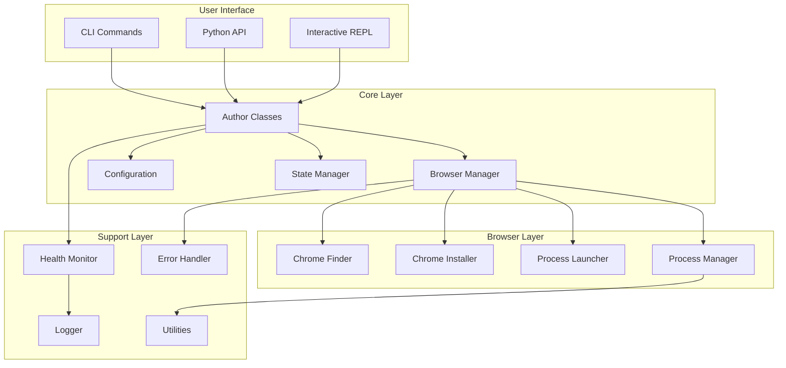
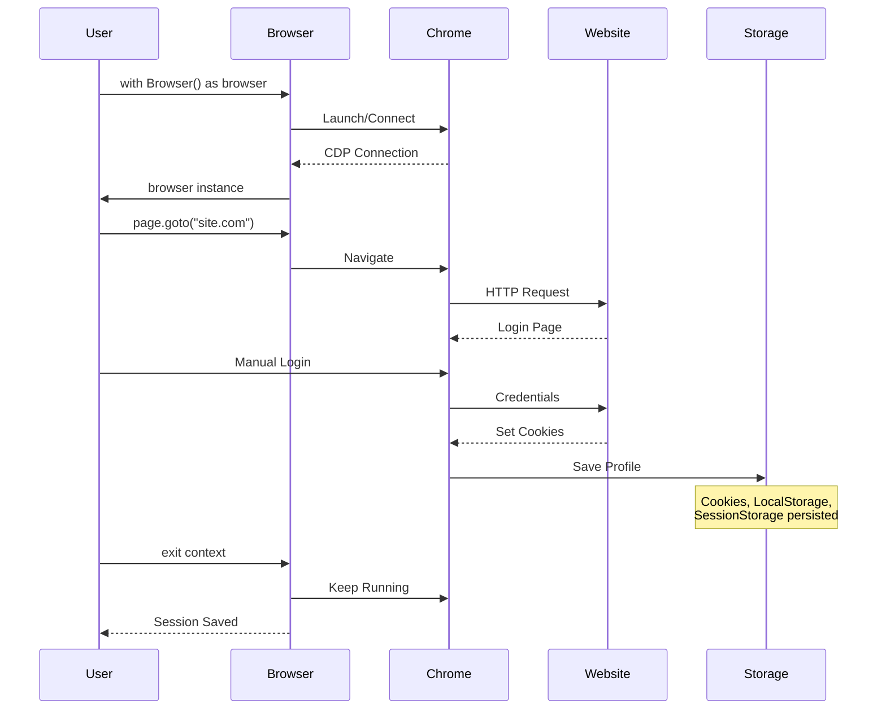
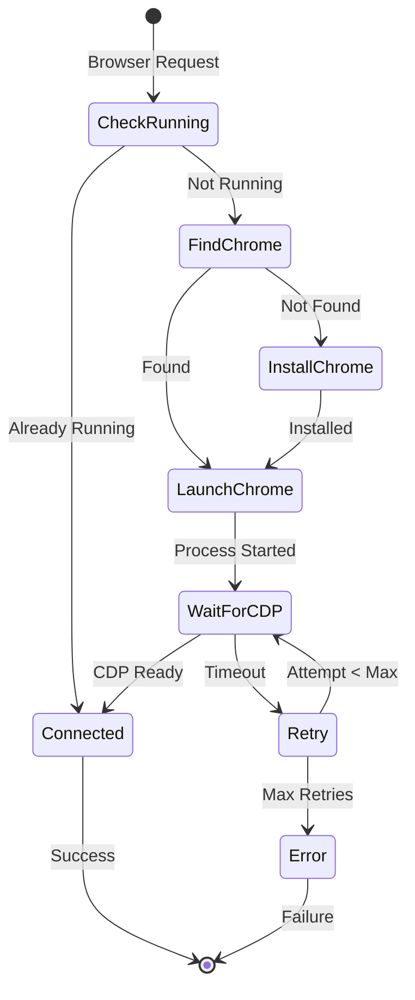
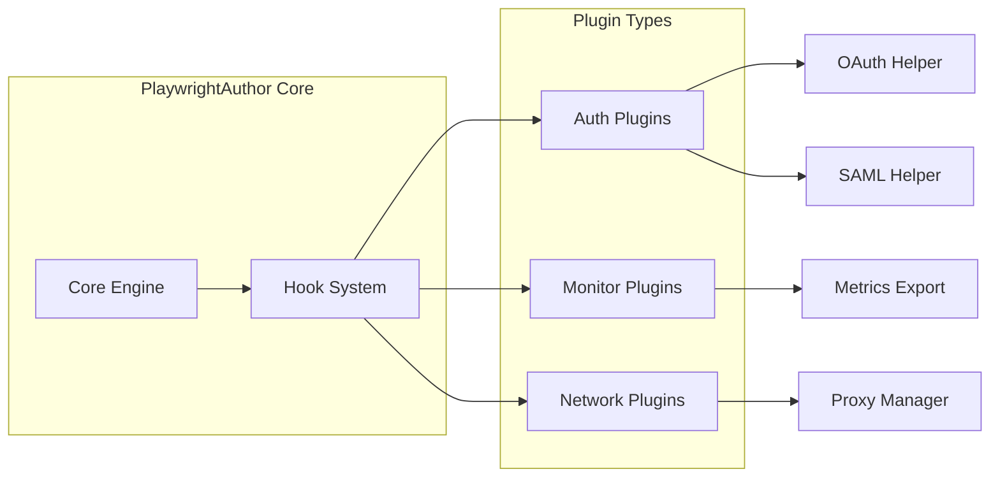
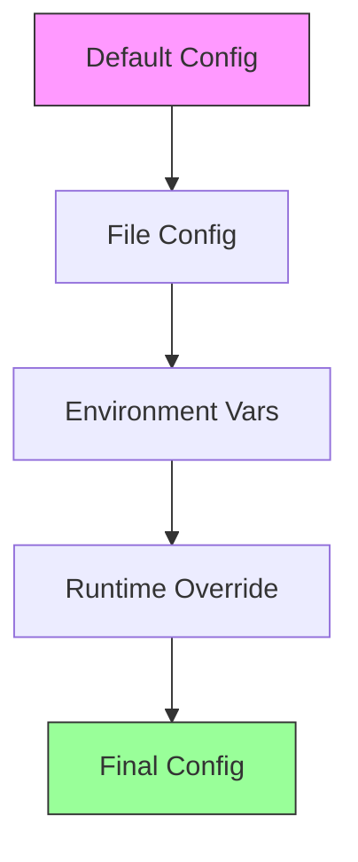
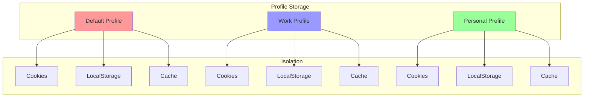
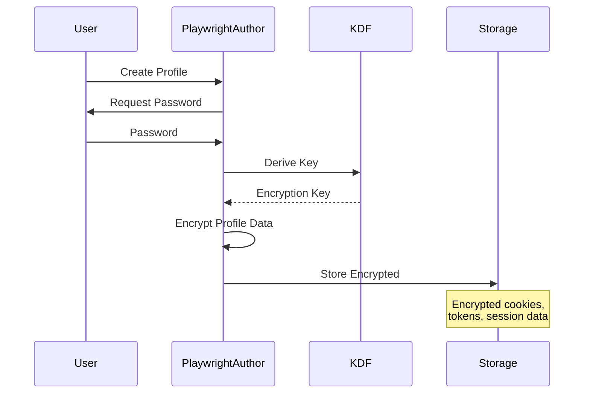

# PlaywrightAuthor Architecture

This section provides detailed insights into PlaywrightAuthor's internal architecture, component design, and system flows.

## 📐 Overview

PlaywrightAuthor is built on a modular architecture that separates concerns and provides flexibility:

## 🏗️ Core Components

### [Browser Lifecycle Management](browser-lifecycle.md)
Understanding how PlaywrightAuthor manages Chrome instances:
- Installation and discovery
- Process management
- Connection handling
- Session persistence

### [Component Architecture](components.md)
Detailed breakdown of each component:
- Author classes (Browser/AsyncBrowser)
- Configuration system
- State management
- Browser management modules

### [Error Handling & Recovery](error-handling.md)
How PlaywrightAuthor handles failures gracefully:
- Exception hierarchy
- Retry mechanisms
- User guidance system
- Crash recovery

### [Monitoring & Metrics](monitoring.md)
Production monitoring capabilities:
- Health checks
- Performance metrics
- Crash detection
- Resource tracking

## 🔄 System Flows

### Authentication Flow

### Connection Management

## 🎯 Design Principles

### 1. **Separation of Concerns**
Each module has a single, well-defined responsibility:
- `browser_manager.py` - High-level orchestration
- `browser/*.py` - Specific browser operations
- `author.py` - User-facing API
- `config.py` - Configuration management

### 2. **Fail-Safe Design**
Multiple layers of error handling:
- Try graceful operations first
- Fall back to forceful methods
- Always provide user guidance
- Never leave system in bad state

### 3. **Cross-Platform Compatibility**
Platform-specific code isolated:
- `finder.py` - Platform-specific paths
- `process.py` - OS-specific process handling
- `paths.py` - Platform directory resolution

### 4. **Performance Optimization**
Lazy loading and caching throughout:
- Playwright imported only when needed
- Chrome path cached after discovery
- Connection reused when possible
- Minimal startup overhead

### 5. **User Experience First**
Every error includes:
- Clear explanation
- Suggested solution
- Exact commands to run
- Links to documentation

## 🔌 Extension Points

### Plugin Architecture (Future)

### Configuration Layers

## 📊 Performance Characteristics

### Startup Performance
- First run: ~2-5s (includes Chrome launch)
- Subsequent runs: ~0.5-1s (connection only)
- With monitoring: +0.1s overhead
- REPL mode: +0.2s for prompt toolkit

### Memory Usage
- Base: ~50MB (Python + PlaywrightAuthor)
- Per browser: ~200MB (Chrome process)
- Per page: ~50-100MB (depending on content)
- Monitoring: ~10MB (metrics storage)

### Scalability
- Profiles: Unlimited (filesystem bound)
- Concurrent browsers: System resource limited
- Pages per browser: ~50-100 recommended
- Monitoring check interval: 5-300s configurable

## 🛡️ Security Architecture

### Profile Isolation

### Future: Encryption

## 📚 Additional Resources

- [Component Details](components.md)
- [Browser Lifecycle](browser-lifecycle.md)
- [Error Handling](error-handling.md)
- [Performance Guide](../performance/index.md)
- [API Reference](../../api/index.md)