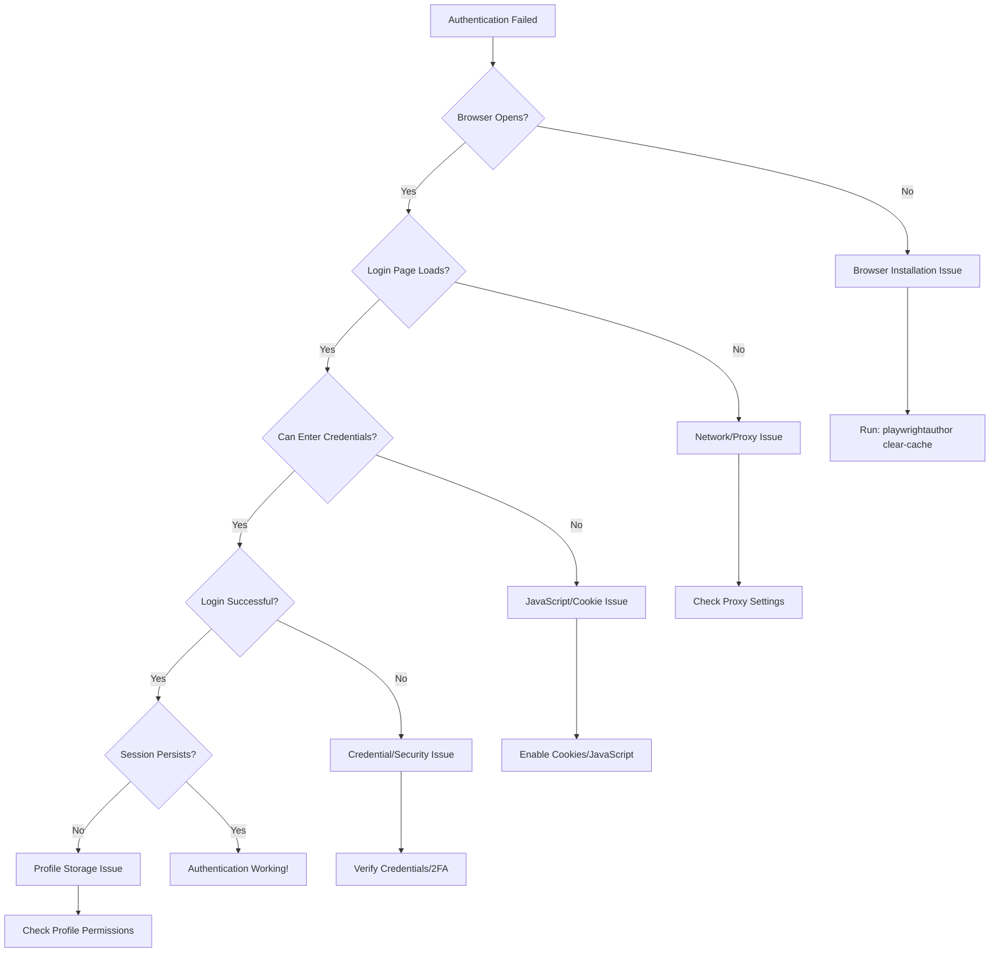

# Authentication Troubleshooting Guide

This guide helps you diagnose and fix authentication issues with PlaywrightAuthor.

## Quick Diagnosis

Run this command first to check your setup:

```bash
playwrightauthor health
```

## Troubleshooting Flowchart



## Common Issues & Solutions

### Issue 1: Browser Won't Launch

**Symptoms**:
- `BrowserLaunchError: Failed to launch Chrome`
- Browser window doesn't appear
- Timeout errors

**Diagnostic Steps**:
```python
# 1. Check Chrome installation
from playwrightauthor.browser.finder import find_chrome_executable
from playwrightauthor.utils.logger import configure

logger = configure(verbose=True)
chrome_path = find_chrome_executable(logger)
print(f"Chrome found at: {chrome_path}")

# 2. Check if Chrome process is running
import psutil
chrome_procs = [p for p in psutil.process_iter() if 'chrome' in p.name().lower()]
print(f"Chrome processes: {len(chrome_procs)}")

# 3. Try manual launch
import subprocess
subprocess.run([str(chrome_path), "--version"])
```

**Solutions**:

1. **Clear cache and reinstall**:
   ```bash
   playwrightauthor clear-cache
   playwrightauthor status
   ```

2. **Platform-specific fixes**:
   
   **macOS**:
   ```bash
   # Grant terminal permissions
   # System Preferences > Security & Privacy > Privacy > Accessibility
   # Add Terminal or your IDE
   
   # Reset Chrome permissions
   tccutil reset Accessibility com.google.Chrome
   ```
   
   **Windows**:
   ```powershell
   # Run as Administrator
   # Check Windows Defender/Antivirus exclusions
   # Add Chrome to firewall exceptions
   ```
   
   **Linux**:
   ```bash
   # Install dependencies
   sudo apt-get update
   sudo apt-get install -y libgbm1 libxss1
   
   # Check display
   echo $DISPLAY  # Should show :0 or similar
   ```

### Issue 2: Network/Connection Problems

**Symptoms**:
- `ERR_CONNECTION_REFUSED`
- `ERR_PROXY_CONNECTION_FAILED`
- Page load timeouts

**Diagnostic Steps**:
```python
# Check CDP connection
from playwrightauthor.connection import ConnectionHealthChecker

checker = ConnectionHealthChecker(9222)
diagnostics = checker.get_connection_diagnostics()
print(f"CDP Available: {diagnostics['cdp_available']}")
print(f"Response Time: {diagnostics['response_time_ms']}ms")
print(f"Error: {diagnostics.get('error', 'None')}")
```

**Solutions**:

1. **Check proxy settings**:
   ```python
   import os
   
   # Disable proxy for local connections
   os.environ['NO_PROXY'] = 'localhost,127.0.0.1'
   
   # Or set proxy if required
   os.environ['HTTP_PROXY'] = 'http://proxy.company.com:8080'
   os.environ['HTTPS_PROXY'] = 'http://proxy.company.com:8080'
   ```

2. **Check firewall**:
   ```bash
   # Allow Chrome debug port
   sudo ufw allow 9222/tcp  # Linux
   
   # Windows: Add firewall rule for port 9222
   ```

3. **Use custom debug port**:
   ```python
   # If 9222 is blocked, use different port
   os.environ['PLAYWRIGHTAUTHOR_DEBUG_PORT'] = '9333'
   ```

### Issue 3: Cookie/JavaScript Blocked

**Symptoms**:
- Login form doesn't work
- "Please enable cookies" message
- JavaScript errors in console

**Diagnostic Steps**:
```python
# Check browser console for errors
with Browser() as browser:
    page = browser.new_page()
    
    # Enable console logging
    page.on("console", lambda msg: print(f"Console: {msg.text}"))
    page.on("pageerror", lambda err: print(f"Error: {err}"))
    
    page.goto("https://example.com/login")
```

**Solutions**:

1. **Enable cookies and JavaScript**:
   ```python
   # Check Chrome settings
   with Browser() as browser:
       page = browser.new_page()
       page.goto("chrome://settings/content/cookies")
       # Ensure "Allow all cookies" is selected
       
       page.goto("chrome://settings/content/javascript")
       # Ensure JavaScript is enabled
   ```

2. **Clear site data**:
   ```python
   # Clear cookies for specific site
   with Browser() as browser:
       context = browser.new_context()
       context.clear_cookies()
       page = context.new_page()
       page.goto("https://example.com")
   ```

### Issue 4: Authentication Failures

**Symptoms**:
- "Invalid credentials" (but they're correct)
- Security challenges/CAPTCHAs
- Account locked messages

**Solutions**:

1. **Add human-like delays**:
   ```python
   import time
   import random
   
   with Browser() as browser:
       page = browser.new_page()
       page.goto("https://example.com/login")
       
       # Random delay before typing
       time.sleep(random.uniform(1, 3))
       
       # Type slowly
       page.type("#username", "user@example.com", delay=100)
       time.sleep(random.uniform(0.5, 1.5))
       
       page.type("#password", "password", delay=100)
       time.sleep(random.uniform(0.5, 1.5))
       
       page.click("button[type='submit']")
   ```

2. **Handle security challenges**:
   ```python
   # Wait for and handle 2FA
   try:
       page.wait_for_selector("input[name='code']", timeout=5000)
       print("2FA required - check your authenticator")
       code = input("Enter 2FA code: ")
       page.fill("input[name='code']", code)
       page.press("input[name='code']", "Enter")
   except:
       print("No 2FA required")
   ```

### Issue 5: Session Not Persisting

**Symptoms**:
- Have to login every time
- "Profile not found" errors
- Cookies not saved

**Diagnostic Steps**:
```python
# Check profile location and permissions
from playwrightauthor.utils.paths import data_dir
import os

profile_path = data_dir() / "profiles" / "default"
print(f"Profile path: {profile_path}")
print(f"Exists: {profile_path.exists()}")
print(f"Writable: {os.access(profile_path.parent, os.W_OK)}")

# List profile contents
if profile_path.exists():
    for item in profile_path.iterdir():
        print(f"  {item.name} ({item.stat().st_size} bytes)")
```

**Solutions**:

1. **Fix permissions**:
   ```bash
   # Linux/macOS
   chmod -R 755 ~/.local/share/playwrightauthor
   
   # Windows (Run as Administrator)
   icacls "%APPDATA%\playwrightauthor" /grant %USERNAME%:F /T
   ```

2. **Check disk space**:
   ```python
   import shutil
   
   path = data_dir()
   stat = shutil.disk_usage(path)
   print(f"Free space: {stat.free / 1024**3:.2f} GB")
   ```

## Advanced Diagnostics

### Complete System Check

```python
def full_diagnostic():
    """Run complete diagnostic check"""
    from playwrightauthor import Browser
    from playwrightauthor.browser.finder import find_chrome_executable
    from playwrightauthor.connection import ConnectionHealthChecker
    from playwrightauthor.utils.paths import data_dir
    import platform
    import os
    
    print("=== PlaywrightAuthor Diagnostic Report ===")
    print(f"\n1. System Info:")
    print(f"   OS: {platform.system()} {platform.release()}")
    print(f"   Python: {platform.python_version()}")
    
    print(f"\n2. Chrome Installation:")
    try:
        chrome = find_chrome_executable()
        print(f"   ✅ Chrome found: {chrome}")
    except:
        print(f"   ❌ Chrome not found")
    
    print(f"\n3. Profile Storage:")
    profile_dir = data_dir() / "profiles"
    print(f"   Path: {profile_dir}")
    print(f"   Exists: {profile_dir.exists()}")
    print(f"   Writable: {os.access(profile_dir, os.W_OK)}")
    
    print(f"\n4. CDP Connection:")
    checker = ConnectionHealthChecker(9222)
    diag = checker.get_connection_diagnostics()
    print(f"   Available: {diag['cdp_available']}")
    print(f"   Response: {diag.get('response_time_ms', 'N/A')}ms")
    
    print(f"\n5. Environment:")
    for key in ['HTTP_PROXY', 'HTTPS_PROXY', 'NO_PROXY', 'DISPLAY']:
        value = os.environ.get(key, 'Not set')
        print(f"   {key}: {value}")

# Run diagnostic
full_diagnostic()
```

### Monitor Authentication Health

```python
def monitor_auth_health(url: str, check_selector: str):
    """Continuously monitor authentication status"""
    import time
    from datetime import datetime
    
    while True:
        try:
            with Browser() as browser:
                page = browser.new_page()
                page.goto(url, wait_until="domcontentloaded", timeout=30000)
                
                # Check if authenticated
                try:
                    page.wait_for_selector(check_selector, timeout=5000)
                    status = "✅ Authenticated"
                except:
                    status = "❌ Not authenticated"
                
                print(f"[{datetime.now():%Y-%m-%d %H:%M:%S}] {status}")
                
        except Exception as e:
            print(f"[{datetime.now():%Y-%m-%d %H:%M:%S}] ❌ Error: {e}")
        
        time.sleep(300)  # Check every 5 minutes

# Example usage
# monitor_auth_health("https://github.com", '[aria-label="Dashboard"]')
```

## Prevention Tips

1. **Regular Maintenance**:
   ```bash
   # Weekly health check
   playwrightauthor health
   
   # Monthly cache cleanup
   playwrightauthor clear-cache --keep-profiles
   ```

2. **Backup Profiles**:
   ```bash
   # Export working profiles
   playwrightauthor profile export default --output backup.zip
   ```

3. **Monitor Logs**:
   ```bash
   # Enable verbose logging
   export PLAYWRIGHTAUTHOR_VERBOSE=true
   export PLAYWRIGHTAUTHOR_LOG_FILE=~/.playwrightauthor/debug.log
   ```

4. **Test Authentication**:
   ```python
   # Simple auth test script
   def test_auth(url: str, success_indicator: str):
       try:
           with Browser() as browser:
               page = browser.new_page()
               page.goto(url)
               page.wait_for_selector(success_indicator, timeout=10000)
               return True
       except:
           return False
   ```

## Getting Help

If you're still experiencing issues:

1. **Collect diagnostic info**:
   ```bash
   playwrightauthor diagnose --json > diagnostic.json
   ```

2. **Check GitHub Issues**:
   - [Search existing issues](https://github.com/twardoch/playwrightauthor/issues)
   - [Create new issue](https://github.com/twardoch/playwrightauthor/issues/new)

3. **Enable debug logging**:
   ```python
   import logging
   logging.basicConfig(level=logging.DEBUG)
   ```

4. **Community Support**:
   - Include diagnostic output
   - Specify the service you're trying to authenticate with
   - Share relevant code snippets (without credentials!)

## Additional Resources

- [Platform-Specific Guides](../platforms/index.md)
- [Performance Optimization](../performance/optimization.md)
- [Security Best Practices](../security/index.md)
- [API Reference](../../api/index.md)