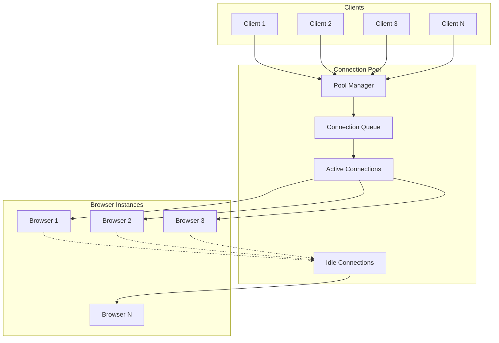

# Connection Pooling Guide

This guide covers connection pooling strategies for PlaywrightAuthor to improve performance and resource efficiency when managing multiple browser instances.

## Why Connection Pooling?

Connection pooling provides several benefits:
- **Reduced Startup Time**: Reuse existing browser instances instead of launching new ones
- **Resource Efficiency**: Control maximum number of concurrent browsers
- **Better Performance**: Eliminate repeated connection overhead
- **Scalability**: Handle high-volume automation tasks efficiently

## Connection Pool Architecture



## Basic Connection Pool

### Simple Pool Implementation

```python
import queue
import threading
import time
from contextlib import contextmanager
from dataclasses import dataclass
from datetime import datetime

@dataclass
class PooledConnection:
    """Wrapper for pooled browser connection."""
    browser: object
    created_at: datetime
    last_used: datetime
    use_count: int = 0
    
    def touch(self):
        """Update last used timestamp."""
        self.last_used = datetime.now()
        self.use_count += 1

class BrowserPool:
    """Basic browser connection pool."""
    
    def __init__(
        self,
        min_size: int = 1,
        max_size: int = 5,
        max_idle_time: int = 300  # 5 minutes
    ):
        self.min_size = min_size
        self.max_size = max_size
        self.max_idle_time = max_idle_time
        
        self._pool = queue.Queue(maxsize=max_size)
        self._all_connections = []
        self._lock = threading.Lock()
        self._shutdown = False
        
        # Initialize minimum connections
        self._initialize_pool()
    
    def _initialize_pool(self):
        """Create initial connections."""
        for _ in range(self.min_size):
            conn = self._create_connection()
            self._pool.put(conn)
    
    def _create_connection(self) -> PooledConnection:
        """Create new browser connection."""
        from playwrightauthor import Browser
        
        browser = Browser().__enter__()
        conn = PooledConnection(
            browser=browser,
            created_at=datetime.now(),
            last_used=datetime.now()
        )
        
        with self._lock:
            self._all_connections.append(conn)
        
        return conn
    
    @contextmanager
    def acquire(self, timeout: float = 30.0):
        """Acquire browser from pool."""
        connection = None
        
        try:
            # Try to get from pool
            try:
                connection = self._pool.get(timeout=timeout)
            except queue.Empty:
                # Create new if under limit
                with self._lock:
                    if len(self._all_connections) < self.max_size:
                        connection = self._create_connection()
                    else:
                        raise RuntimeError("Connection pool exhausted")
            
            # Update usage
            connection.touch()
            
            # Yield browser
            yield connection.browser
            
        finally:
            # Return to pool
            if connection and not self._shutdown:
                self._pool.put(connection)
    
    def close(self):
        """Close all connections."""
        self._shutdown = True
        
        # Close all connections
        with self._lock:
            for conn in self._all_connections:
                try:
                    conn.browser.__exit__(None, None, None)
                except:
                    pass
            
            self._all_connections.clear()

# Usage
pool = BrowserPool(min_size=2, max_size=10)

# Use browsers from pool
def process_url(url: str):
    with pool.acquire() as browser:
        page = browser.new_page()
        page.goto(url)
        title = page.title()
        page.close()
        return title

# Process multiple URLs concurrently
from concurrent.futures import ThreadPoolExecutor

urls = ["https://example.com", "https://google.com", "https://github.com"]

with ThreadPoolExecutor(max_workers=5) as executor:
    results = list(executor.map(process_url, urls))

print(results)
pool.close()
```

## Advanced Connection Pool

### Full-Featured Pool with Health Checks

```python
import asyncio
from enum import Enum
from typing import Optional, Dict, Any
import logging

class ConnectionState(Enum):
    """Connection states."""
    IDLE = "idle"
    ACTIVE = "active"
    UNHEALTHY = "unhealthy"
    CLOSED = "closed"

class AdvancedBrowserPool:
    """Advanced connection pool with health checks and monitoring."""
    
    def __init__(
        self,
        min_size: int = 2,
        max_size: int = 10,
        max_idle_time: int = 300,
        health_check_interval: int = 30,
        max_use_count: int = 100,
        max_lifetime: int = 3600
    ):
        self.min_size = min_size
        self.max_size = max_size
        self.max_idle_time = max_idle_time
        self.health_check_interval = health_check_interval
        self.max_use_count = max_use_count
        self.max_lifetime = max_lifetime
        
        self._connections: Dict[str, PooledConnection] = {}
        self._idle_queue = asyncio.Queue(maxsize=max_size)
        self._semaphore = asyncio.Semaphore(max_size)
        self._stats = {
            'created': 0,
            'destroyed': 0,
            'acquired': 0,
            'released': 0,
            'health_checks': 0,
            'failed_health_checks': 0
        }
        
        self.logger = logging.getLogger(__name__)
        self._running = False
        self._health_check_task = None
    
    async def start(self):
        """Start the pool."""
        self._running = True
        
        # Create initial connections
        for _ in range(self.min_size):
            await self._create_connection()
        
        # Start health check task
        self._health_check_task = asyncio.create_task(self._health_check_loop())
        
        self.logger.info(f"Pool started with {self.min_size} connections")
    
    async def stop(self):
        """Stop the pool."""
        self._running = False
        
        # Cancel health check
        if self._health_check_task:
            self._health_check_task.cancel()
            try:
                await self._health_check_task
            except asyncio.CancelledError:
                pass
        
        # Close all connections
        for conn_id in list(self._connections.keys()):
            await self._destroy_connection(conn_id)
        
        self.logger.info("Pool stopped")
    
    async def _create_connection(self) -> str:
        """Create new connection."""
        from playwrightauthor import AsyncBrowser
        
        async with self._semaphore:
            browser = await AsyncBrowser().__aenter__()
            
            conn_id = f"conn_{self._stats['created']}"
            conn = PooledConnection(
                browser=browser,
                created_at=datetime.now(),
                last_used=datetime.now()
            )
            
            self._connections[conn_id] = conn
            await self._idle_queue.put(conn_id)
            
            self._stats['created'] += 1
            self.logger.debug(f"Created connection {conn_id}")
            
            return conn_id
    
    async def _destroy_connection(self, conn_id: str):
        """Destroy a connection."""
        if conn_id not in self._connections:
            return
        
        conn = self._connections[conn_id]
        
        try:
            await conn.browser.__aexit__(None, None, None)
        except Exception as e:
            self.logger.error(f"Error closing connection {conn_id}: {e}")
        
        del self._connections[conn_id]
        self._stats['destroyed'] += 1
        
        self.logger.debug(f"Destroyed connection {conn_id}")
    
    async def _check_connection_health(self, conn_id: str) -> bool:
        """Check if connection is healthy."""
        if conn_id not in self._connections:
            return False
        
        conn = self._connections[conn_id]
        
        try:
            # Simple health check - create and close a page
            page = await conn.browser.new_page()
            await page.goto("about:blank", timeout=5000)
            await page.close()
            
            return True
        except Exception as e:
            self.logger.warning(f"Health check failed for {conn_id}: {e}")
            return False
    
    async def _health_check_loop(self):
        """Periodic health check loop."""
        while self._running:
            try:
                await asyncio.sleep(self.health_check_interval)
                
                # Check all idle connections
                idle_connections = []
                
                # Get all idle connections
                while not self._idle_queue.empty():
                    try:
                        conn_id = self._idle_queue.get_nowait()
                        idle_connections.append(conn_id)
                    except asyncio.QueueEmpty:
                        break
                
                # Check health and lifecycle
                for conn_id in idle_connections:
                    conn = self._connections.get(conn_id)
                    if not conn:
                        continue
                    
                    self._stats['health_checks'] += 1
                    
                    # Check lifetime
                    age = (datetime.now() - conn.created_at).total_seconds()
                    if age > self.max_lifetime:
                        self.logger.info(f"Connection {conn_id} exceeded lifetime")
                        await self._destroy_connection(conn_id)
                        continue
                    
                    # Check use count
                    if conn.use_count > self.max_use_count:
                        self.logger.info(f"Connection {conn_id} exceeded use count")
                        await self._destroy_connection(conn_id)
                        continue
                    
                    # Check idle time
                    idle_time = (datetime.now() - conn.last_used).total_seconds()
                    if idle_time > self.max_idle_time:
                        self.logger.info(f"Connection {conn_id} exceeded idle time")
                        await self._destroy_connection(conn_id)
                        continue
                    
                    # Health check
                    if not await self._check_connection_health(conn_id):
                        self._stats['failed_health_checks'] += 1
                        await self._destroy_connection(conn_id)
                        continue
                    
                    # Return to pool if healthy
                    await self._idle_queue.put(conn_id)
                
                # Ensure minimum connections
                current_count = len(self._connections)
                if current_count < self.min_size:
                    for _ in range(self.min_size - current_count):
                        await self._create_connection()
                
            except Exception as e:
                self.logger.error(f"Health check error: {e}")
    
    async def acquire(self, timeout: float = 30.0) -> Any:
        """Acquire connection from pool."""
        start_time = asyncio.get_event_loop().time()
        
        while True:
            try:
                # Try to get idle connection
                conn_id = await asyncio.wait_for(
                    self._idle_queue.get(),
                    timeout=min(1.0, timeout)
                )
                
                conn = self._connections.get(conn_id)
                if conn:
                    conn.touch()
                    self._stats['acquired'] += 1
                    return conn.browser
                
            except asyncio.TimeoutError:
                # Check if we can create new connection
                if len(self._connections) < self.max_size:
                    conn_id = await self._create_connection()
                    conn = self._connections[conn_id]
                    conn.touch()
                    self._stats['acquired'] += 1
                    return conn.browser
                
                # Check timeout
                if asyncio.get_event_loop().time() - start_time > timeout:
                    raise TimeoutError("Failed to acquire connection from pool")
    
    async def release(self, browser: Any):
        """Release connection back to pool."""
        # Find connection by browser
        conn_id = None
        for cid, conn in self._connections.items():
            if conn.browser == browser:
                conn_id = cid
                break
        
        if conn_id:
            await self._idle_queue.put(conn_id)
            self._stats['released'] += 1
        else:
            self.logger.warning("Released unknown browser connection")
    
    def get_stats(self) -> Dict[str, Any]:
        """Get pool statistics."""
        return {
            **self._stats,
            'total_connections': len(self._connections),
            'idle_connections': self._idle_queue.qsize(),
            'active_connections': len(self._connections) - self._idle_queue.qsize()
        }

# Usage
async def advanced_pool_example():
    pool = AdvancedBrowserPool(
        min_size=3,
        max_size=10,
        health_check_interval=30
    )
    
    await pool.start()
    
    try:
        # Process URLs with pool
        async def process_url(url: str):
            browser = await pool.acquire()
            try:
                page = await browser.new_page()
                await page.goto(url)
                title = await page.title()
                await page.close()
                return title
            finally:
                await pool.release(browser)
        
        # Concurrent processing
        urls = ["https://example.com"] * 20
        tasks = [process_url(url) for url in urls]
        results = await asyncio.gather(*tasks)
        
        # Check stats
        stats = pool.get_stats()
        print(f"Pool stats: {stats}")
        
    finally:
        await pool.stop()

# Run example
asyncio.run(advanced_pool_example())
```

## Pool Patterns

### 1. Profile-Based Pools

```python
class ProfileBasedPool:
    """Separate pools for different browser profiles."""
    
    def __init__(self):
        self.pools = {}
        self.default_pool_config = {
            'min_size': 1,
            'max_size': 5
        }
    
    def get_pool(self, profile: str) -> BrowserPool:
        """Get or create pool for profile."""
        if profile not in self.pools:
            self.pools[profile] = BrowserPool(
                **self.default_pool_config,
                profile=profile
            )
        
        return self.pools[profile]
    
    @contextmanager
    def acquire(self, profile: str = "default"):
        """Acquire browser from profile-specific pool."""
        pool = self.get_pool(profile)
        
        with pool.acquire() as browser:
            yield browser
    
    def close_all(self):
        """Close all pools."""
        for pool in self.pools.values():
            pool.close()

# Usage
profile_pool = ProfileBasedPool()

# Use different profiles
with profile_pool.acquire("work") as browser:
    # Work profile browser
    pass

with profile_pool.acquire("personal") as browser:
    # Personal profile browser
    pass

profile_pool.close_all()
```

### 2. Priority Queue Pool

```python
import heapq
from dataclasses import dataclass, field

@dataclass
class PriorityRequest:
    """Priority-based connection request."""
    priority: int
    request_id: str
    future: asyncio.Future
    timestamp: float = field(default_factory=time.time)
    
    def __lt__(self, other):
        # Lower priority number = higher priority
        return self.priority < other.priority

class PriorityBrowserPool:
    """Pool with priority-based allocation."""
    
    def __init__(self, max_size: int = 10):
        self.max_size = max_size
        self._connections = []
        self._available = asyncio.Queue()
        self._waiting = []  # Priority queue
        self._lock = asyncio.Lock()
    
    async def acquire(self, priority: int = 5) -> Any:
        """Acquire with priority (1=highest, 10=lowest)."""
        # Try immediate acquisition
        try:
            conn = self._available.get_nowait()
            return conn
        except asyncio.QueueEmpty:
            pass
        
        # Add to priority queue
        future = asyncio.Future()
        request = PriorityRequest(
            priority=priority,
            request_id=str(time.time()),
            future=future
        )
        
        async with self._lock:
            heapq.heappush(self._waiting, request)
        
        # Wait for connection
        return await future
    
    async def release(self, browser: Any):
        """Release connection back to pool."""
        async with self._lock:
            if self._waiting:
                # Give to highest priority waiter
                request = heapq.heappop(self._waiting)
                request.future.set_result(browser)
            else:
                # Return to available pool
                await self._available.put(browser)

# Usage
priority_pool = PriorityBrowserPool(max_size=5)

# High priority request
high_priority_browser = await priority_pool.acquire(priority=1)

# Normal priority request
normal_browser = await priority_pool.acquire(priority=5)

# Low priority request
low_priority_browser = await priority_pool.acquire(priority=9)
```

### 3. Geographic Pool Distribution

```python
class GeographicBrowserPool:
    """Pool with geographic distribution."""
    
    def __init__(self):
        self.region_pools = {
            'us-east': {'proxy': 'http://us-east-proxy.com:8080'},
            'us-west': {'proxy': 'http://us-west-proxy.com:8080'},
            'eu-west': {'proxy': 'http://eu-west-proxy.com:8080'},
            'ap-south': {'proxy': 'http://ap-south-proxy.com:8080'}
        }
        self.pools = {}
    
    def _create_regional_pool(self, region: str) -> BrowserPool:
        """Create pool for specific region."""
        config = self.region_pools.get(region, {})
        
        class RegionalBrowserPool(BrowserPool):
            def _create_connection(self):
                from playwrightauthor import Browser
                
                # Regional configuration
                args = []
                if 'proxy' in config:
                    args.append(f'--proxy-server={config["proxy"]}')
                
                browser = Browser(args=args).__enter__()
                # ... rest of connection creation
        
        return RegionalBrowserPool(min_size=2, max_size=5)
    
    @contextmanager
    def acquire(self, region: str = 'us-east'):
        """Acquire browser from regional pool."""
        if region not in self.pools:
            self.pools[region] = self._create_regional_pool(region)
        
        with self.pools[region].acquire() as browser:
            yield browser

# Usage
geo_pool = GeographicBrowserPool()

# Use browser from specific region
with geo_pool.acquire('eu-west') as browser:
    page = browser.new_page()
    page.goto("https://example.com")
    # Browser uses EU proxy
```

## Pool Monitoring

### Pool Metrics Dashboard

```python
import matplotlib.pyplot as plt
from matplotlib.animation import FuncAnimation
from collections import deque
import numpy as np

class PoolMetricsDashboard:
    """Real-time pool metrics visualization."""
    
    def __init__(self, pool: BrowserPool, window_size: int = 60):
        self.pool = pool
        self.window_size = window_size
        
        # Metrics history
        self.timestamps = deque(maxlen=window_size)
        self.active_connections = deque(maxlen=window_size)
        self.idle_connections = deque(maxlen=window_size)
        self.queue_size = deque(maxlen=window_size)
        self.avg_wait_time = deque(maxlen=window_size)
        
        # Setup plot
        self.fig, self.axes = plt.subplots(2, 2, figsize=(12, 8))
        self.fig.suptitle('Browser Pool Metrics Dashboard')
    
    def update_metrics(self):
        """Update metrics from pool."""
        stats = self.pool.get_stats()
        
        self.timestamps.append(time.time())
        self.active_connections.append(stats.get('active_connections', 0))
        self.idle_connections.append(stats.get('idle_connections', 0))
        self.queue_size.append(stats.get('queue_size', 0))
        self.avg_wait_time.append(stats.get('avg_wait_time', 0))
    
    def animate(self, frame):
        """Update dashboard plots."""
        self.update_metrics()
        
        # Clear axes
        for ax in self.axes.flat:
            ax.clear()
        
        if len(self.timestamps) < 2:
            return
        
        # Convert timestamps to relative seconds
        times = np.array(self.timestamps)
        times = times - times[0]
        
        # Plot 1: Connection counts
        ax1 = self.axes[0, 0]
        ax1.plot(times, self.active_connections, 'r-', label='Active')
        ax1.plot(times, self.idle_connections, 'g-', label='Idle')
        ax1.set_title('Connection Status')
        ax1.set_xlabel('Time (s)')
        ax1.set_ylabel('Count')
        ax1.legend()
        ax1.grid(True, alpha=0.3)
        
        # Plot 2: Queue size
        ax2 = self.axes[0, 1]
        ax2.plot(times, self.queue_size, 'b-')
        ax2.fill_between(times, self.queue_size, alpha=0.3)
        ax2.set_title('Waiting Queue Size')
        ax2.set_xlabel('Time (s)')
        ax2.set_ylabel('Requests')
        ax2.grid(True, alpha=0.3)
        
        # Plot 3: Wait times
        ax3 = self.axes[1, 0]
        ax3.plot(times, self.avg_wait_time, 'orange')
        ax3.set_title('Average Wait Time')
        ax3.set_xlabel('Time (s)')
        ax3.set_ylabel('Wait Time (ms)')
        ax3.grid(True, alpha=0.3)
        
        # Plot 4: Pool utilization
        ax4 = self.axes[1, 1]
        total = np.array(self.active_connections) + np.array(self.idle_connections)
        utilization = np.array(self.active_connections) / np.maximum(total, 1) * 100
        ax4.plot(times, utilization, 'purple')
        ax4.fill_between(times, utilization, alpha=0.3)
        ax4.set_title('Pool Utilization')
        ax4.set_xlabel('Time (s)')
        ax4.set_ylabel('Utilization %')
        ax4.set_ylim(0, 100)
        ax4.grid(True, alpha=0.3)
        
        plt.tight_layout()
    
    def start(self):
        """Start dashboard animation."""
        anim = FuncAnimation(
            self.fig,
            self.animate,
            interval=1000,  # Update every second
            cache_frame_data=False
        )
        plt.show()

# Usage
pool = BrowserPool(min_size=3, max_size=10)
dashboard = PoolMetricsDashboard(pool)

# Start dashboard in separate thread
import threading
dashboard_thread = threading.Thread(target=dashboard.start)
dashboard_thread.daemon = True
dashboard_thread.start()

# Run your automation...
```

## Pool Optimization

### Dynamic Pool Sizing

```python
class DynamicBrowserPool(BrowserPool):
    """Pool that adjusts size based on demand."""
    
    def __init__(self, initial_size: int = 2, max_size: int = 20):
        super().__init__(min_size=initial_size, max_size=max_size)
        
        self.metrics = {
            'wait_times': deque(maxlen=100),
            'queue_lengths': deque(maxlen=100),
            'utilization': deque(maxlen=100)
        }
        
        self._adjustment_task = None
    
    async def start(self):
        """Start pool with dynamic adjustment."""
        await super().start()
        self._adjustment_task = asyncio.create_task(self._adjust_pool_size())
    
    async def _adjust_pool_size(self):
        """Periodically adjust pool size based on metrics."""
        while self._running:
            await asyncio.sleep(30)  # Check every 30 seconds
            
            # Calculate metrics
            avg_wait = np.mean(self.metrics['wait_times']) if self.metrics['wait_times'] else 0
            avg_queue = np.mean(self.metrics['queue_lengths']) if self.metrics['queue_lengths'] else 0
            avg_util = np.mean(self.metrics['utilization']) if self.metrics['utilization'] else 0
            
            current_size = len(self._connections)
            
            # Scaling rules
            if avg_wait > 5000 and current_size < self.max_size:  # >5s wait
                # Scale up
                new_size = min(current_size + 2, self.max_size)
                self.logger.info(f"Scaling up pool from {current_size} to {new_size}")
                
                for _ in range(new_size - current_size):
                    await self._create_connection()
            
            elif avg_util < 30 and current_size > self.min_size:  # <30% utilization
                # Scale down
                new_size = max(current_size - 1, self.min_size)
                self.logger.info(f"Scaling down pool from {current_size} to {new_size}")
                
                # Remove idle connections
                for _ in range(current_size - new_size):
                    try:
                        conn_id = await asyncio.wait_for(
                            self._idle_queue.get(),
                            timeout=1.0
                        )
                        await self._destroy_connection(conn_id)
                    except asyncio.TimeoutError:
                        break
```

### Connection Warming

```python
class WarmBrowserPool(BrowserPool):
    """Pool with connection warming."""
    
    async def _create_connection(self) -> str:
        """Create and warm connection."""
        conn_id = await super()._create_connection()
        
        # Warm the connection
        await self._warm_connection(conn_id)
        
        return conn_id
    
    async def _warm_connection(self, conn_id: str):
        """Warm up a connection for better performance."""
        conn = self._connections.get(conn_id)
        if not conn:
            return
        
        browser = conn.browser
        
        # Pre-create a context
        context = await browser.new_context(
            viewport={'width': 1280, 'height': 720},
            user_agent='Mozilla/5.0 (Windows NT 10.0; Win64; x64) AppleWebKit/537.36'
        )
        
        # Pre-warm with common operations
        page = await context.new_page()
        
        # Load a minimal page to initialize resources
        await page.goto('about:blank')
        
        # Pre-compile common JavaScript
        await page.evaluate('''() => {
            // Pre-warm JavaScript engine
            const arr = Array(1000).fill(0).map((_, i) => i);
            const sum = arr.reduce((a, b) => a + b, 0);
            
            // Pre-warm DOM operations
            const div = document.createElement('div');
            div.innerHTML = '<p>Warm</p>';
            document.body.appendChild(div);
            document.body.removeChild(div);
            
            return sum;
        }''')
        
        # Clean up warming resources
        await page.close()
        await context.close()
        
        self.logger.debug(f"Warmed connection {conn_id}")
```

## Best Practices

1. **Right-size Your Pool**
   - Start with min_size = 2-3
   - Set max_size based on system resources
   - Monitor and adjust based on usage

2. **Implement Health Checks**
   - Regular connection validation
   - Automatic recovery from failures
   - Remove unhealthy connections

3. **Use Connection Limits**
   - Max lifetime to prevent memory leaks
   - Max use count to ensure freshness
   - Idle timeout to free resources

4. **Monitor Pool Metrics**
   - Track wait times
   - Monitor utilization
   - Alert on pool exhaustion

5. **Handle Failures Gracefully**
   - Implement retry logic
   - Provide fallback options
   - Log issues for debugging

## Additional Resources

- [Performance Optimization](index.md)
- [Memory Management](memory-management.md)
- [Browser Architecture](../architecture/browser-lifecycle.md)
- [Monitoring Guide](monitoring.md)