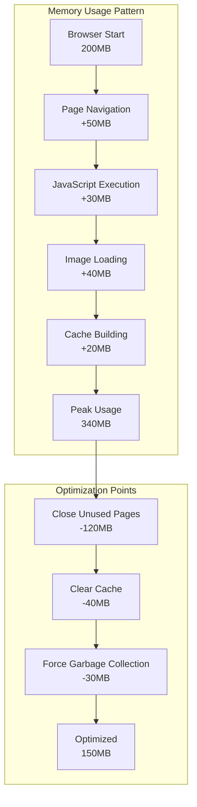

# Performance Optimization Guide

This guide provides comprehensive strategies for optimizing PlaywrightAuthor performance, managing resources efficiently, and debugging performance issues.

## 🎯 Performance Overview

PlaywrightAuthor is designed for efficiency, but performance can vary based on:
- Hardware resources (CPU, RAM, disk)
- Number of browser instances
- Page complexity and JavaScript execution
- Network conditions
- Profile size and cache

## 📊 Performance Benchmarks

### Baseline Performance Metrics

| Operation | Cold Start | Warm Start | Memory Usage | CPU Usage |
|-----------|------------|------------|--------------|-----------|
| Browser Launch | 2-5s | 0.5-1s | 200-300MB | 10-20% |
| Page Navigation | 1-3s | 0.5-1s | 50-100MB | 5-15% |
| Screenshot | 100-500ms | 50-200ms | +20-50MB | 20-40% |
| PDF Generation | 500-2000ms | 200-1000ms | +50-100MB | 30-50% |

### Scalability Limits

| Resource | Recommended | Maximum | Impact |
|----------|-------------|---------|---------|
| Browser Instances | 1-5 | 10-20 | Memory/CPU |
| Pages per Browser | 5-10 | 50-100 | Memory |
| Concurrent Operations | 3-5 | 10-15 | CPU/Network |
| Profile Size | <100MB | <1GB | Disk I/O |

## 🚀 Quick Optimizations

```python
from playwrightauthor import Browser

# Optimal configuration for performance
PERFORMANCE_CONFIG = {
    # Browser settings
    'args': [
        '--disable-blink-features=AutomationControlled',
        '--disable-dev-shm-usage',  # Use disk instead of shared memory
        '--disable-gpu',  # Disable GPU in headless
        '--no-sandbox',  # Faster startup (use with caution)
        '--disable-setuid-sandbox',
        '--disable-web-security',  # Faster but less secure
        '--disable-features=TranslateUI',
        '--disable-extensions',
        '--disable-images',  # Don't load images
        '--disable-javascript',  # If JS not needed
    ],
    'viewport_width': 1280,
    'viewport_height': 720,
    'headless': True,  # Always faster
    'timeout': 30000
}

with Browser(**PERFORMANCE_CONFIG) as browser:
    # Optimized browser instance
    pass
```

## 📈 Resource Optimization Strategies

### Memory Management



#### Memory Optimization Techniques

```python
import gc
import psutil
import os

class MemoryOptimizedBrowser:
    """Browser with memory optimization features."""
    
    def __init__(self, memory_limit_mb: int = 1024):
        self.memory_limit_mb = memory_limit_mb
        self.browser = None
        self.pages = []
    
    def check_memory(self):
        """Check current memory usage."""
        process = psutil.Process(os.getpid())
        memory_mb = process.memory_info().rss / 1024 / 1024
        return memory_mb
    
    def optimize_memory(self):
        """Optimize memory usage."""
        # Close old pages
        if len(self.pages) > 5:
            for page in self.pages[:-5]:
                page.close()
            self.pages = self.pages[-5:]
        
        # Clear caches
        for page in self.pages:
            page.evaluate("() => { window.localStorage.clear(); }")
        
        # Force garbage collection
        gc.collect()
    
    def new_page_with_limit(self):
        """Create new page with memory checking."""
        current_memory = self.check_memory()
        
        if current_memory > self.memory_limit_mb:
            print(f"Memory limit reached ({current_memory}MB), optimizing...")
            self.optimize_memory()
        
        page = self.browser.new_page()
        self.pages.append(page)
        
        # Disable memory-heavy features
        page.route("**/*.{png,jpg,jpeg,gif,webp}", lambda route: route.abort())
        
        return page

# Usage
with Browser() as browser:
    optimizer = MemoryOptimizedBrowser()
    optimizer.browser = browser
    
    # Create pages with memory management
    for i in range(20):
        page = optimizer.new_page_with_limit()
        page.goto("https://example.com")
        # Process page...
```

### CPU Optimization

```python
import time
import threading
from concurrent.futures import ThreadPoolExecutor, as_completed

class CPUOptimizedAutomation:
    """CPU-efficient automation strategies."""
    
    @staticmethod
    def throttle_operations(operations: list, max_concurrent: int = 3, delay: float = 0.5):
        """Throttle operations to prevent CPU spikes."""
        results = []
        
        with ThreadPoolExecutor(max_workers=max_concurrent) as executor:
            # Submit operations with delay
            futures = []
            for i, operation in enumerate(operations):
                if i > 0:
                    time.sleep(delay)  # Delay between submissions
                
                future = executor.submit(operation)
                futures.append(future)
            
            # Collect results
            for future in as_completed(futures):
                results.append(future.result())
        
        return results
    
    @staticmethod
    def batch_process_pages(urls: list, process_func, batch_size: int = 5):
        """Process pages in batches to manage CPU."""
        results = []
        
        with Browser() as browser:
            for i in range(0, len(urls), batch_size):
                batch = urls[i:i + batch_size]
                
                # Process batch
                pages = []
                for url in batch:
                    page = browser.new_page()
                    page.goto(url)
                    pages.append(page)
                
                # Process all pages in batch
                for page in pages:
                    result = process_func(page)
                    results.append(result)
                
                # Clean up batch
                for page in pages:
                    page.close()
                
                # Cool down between batches
                time.sleep(1)
        
        return results
```

### Network Optimization

```python
class NetworkOptimizedBrowser:
    """Network optimization strategies."""
    
    @staticmethod
    def configure_network_optimizations(page):
        """Configure page for network efficiency."""
        
        # Block unnecessary resources
        def handle_route(route):
            resource_type = route.request.resource_type
            url = route.request.url
            
            # Block non-essential resources
            blocked_types = ['image', 'media', 'font', 'stylesheet']
            blocked_domains = ['googletagmanager.com', 'google-analytics.com', 'doubleclick.net']
            
            if resource_type in blocked_types:
                route.abort()
            elif any(domain in url for domain in blocked_domains):
                route.abort()
            else:
                route.continue_()
        
        page.route("**/*", handle_route)
        
        # Enable cache
        page.context.set_offline(False)
        
        # Set network conditions (optional throttling)
        # page.context.set_extra_http_headers({'Save-Data': 'on'})
    
    @staticmethod
    def parallel_fetch(urls: list, max_concurrent: int = 5):
        """Fetch multiple URLs in parallel."""
        from concurrent.futures import ThreadPoolExecutor
        
        def fetch_url(url):
            with Browser() as browser:
                page = browser.new_page()
                NetworkOptimizedBrowser.configure_network_optimizations(page)
                
                response = page.goto(url, wait_until='domcontentloaded')
                content = page.content()
                page.close()
                
                return {
                    'url': url,
                    'status': response.status,
                    'size': len(content),
                    'content': content
                }
        
        with ThreadPoolExecutor(max_workers=max_concurrent) as executor:
            results = list(executor.map(fetch_url, urls))
        
        return results
```

## 🔄 Connection Pooling

### Browser Pool Implementation

```python
import queue
import threading
import time
from contextlib import contextmanager

class BrowserPool:
    """Reusable browser instance pool."""
    
    def __init__(self, min_size: int = 2, max_size: int = 10):
        self.min_size = min_size
        self.max_size = max_size
        self.pool = queue.Queue(maxsize=max_size)
        self.size = 0
        self.lock = threading.Lock()
        
        # Pre-populate pool
        self._initialize_pool()
    
    def _initialize_pool(self):
        """Create initial browser instances."""
        for _ in range(self.min_size):
            browser = self._create_browser()
            self.pool.put(browser)
            self.size += 1
    
    def _create_browser(self):
        """Create new browser instance."""
        from playwrightauthor import Browser
        return Browser().__enter__()
    
    @contextmanager
    def get_browser(self, timeout: float = 30):
        """Get browser from pool."""
        browser = None
        
        try:
            # Try to get from pool
            try:
                browser = self.pool.get(timeout=timeout)
            except queue.Empty:
                # Create new if under limit
                with self.lock:
                    if self.size < self.max_size:
                        browser = self._create_browser()
                        self.size += 1
                    else:
                        raise RuntimeError("Browser pool exhausted")
            
            yield browser
            
        finally:
            # Return to pool
            if browser:
                self.pool.put(browser)
    
    def shutdown(self):
        """Close all browsers in pool."""
        while not self.pool.empty():
            try:
                browser = self.pool.get_nowait()
                browser.__exit__(None, None, None)
            except queue.Empty:
                break

# Usage
pool = BrowserPool(min_size=3, max_size=10)

# Use browsers from pool
urls = ["https://example.com", "https://google.com", "https://github.com"]

def process_url(url):
    with pool.get_browser() as browser:
        page = browser.new_page()
        page.goto(url)
        title = page.title()
        page.close()
        return title

# Process URLs using pool
from concurrent.futures import ThreadPoolExecutor

with ThreadPoolExecutor(max_workers=5) as executor:
    results = list(executor.map(process_url, urls * 10))

pool.shutdown()
```

### Page Recycling

```python
class PageRecycler:
    """Recycle pages instead of creating new ones."""
    
    def __init__(self, browser, max_pages: int = 10):
        self.browser = browser
        self.max_pages = max_pages
        self.available_pages = queue.Queue()
        self.all_pages = []
    
    def get_page(self):
        """Get recycled or new page."""
        try:
            # Try to get recycled page
            page = self.available_pages.get_nowait()
            
            # Reset page state
            page.goto("about:blank")
            page.evaluate("() => { localStorage.clear(); sessionStorage.clear(); }")
            
        except queue.Empty:
            # Create new page if under limit
            if len(self.all_pages) < self.max_pages:
                page = self.browser.new_page()
                self.all_pages.append(page)
            else:
                # Wait for available page
                page = self.available_pages.get()
        
        return page
    
    def return_page(self, page):
        """Return page to pool for recycling."""
        self.available_pages.put(page)
    
    def cleanup(self):
        """Close all pages."""
        for page in self.all_pages:
            page.close()

# Usage
with Browser() as browser:
    recycler = PageRecycler(browser)
    
    # Process many URLs with page recycling
    for url in urls:
        page = recycler.get_page()
        try:
            page.goto(url)
            # Process page...
        finally:
            recycler.return_page(page)
    
    recycler.cleanup()
```

## 📊 Monitoring & Profiling

### Performance Monitoring

```python
import time
import psutil
from dataclasses import dataclass, field
from typing import Dict, List
import statistics

@dataclass
class PerformanceMetrics:
    """Performance metrics container."""
    operation: str
    start_time: float = field(default_factory=time.time)
    end_time: float = None
    memory_start: float = None
    memory_end: float = None
    cpu_percent: float = None
    
    def complete(self):
        """Mark operation as complete."""
        self.end_time = time.time()
        process = psutil.Process()
        self.memory_end = process.memory_info().rss / 1024 / 1024
        self.cpu_percent = process.cpu_percent(interval=0.1)
    
    @property
    def duration(self) -> float:
        """Operation duration in seconds."""
        if self.end_time:
            return self.end_time - self.start_time
        return time.time() - self.start_time
    
    @property
    def memory_delta(self) -> float:
        """Memory change in MB."""
        if self.memory_start and self.memory_end:
            return self.memory_end - self.memory_start
        return 0

class PerformanceMonitor:
    """Monitor and analyze performance."""
    
    def __init__(self):
        self.metrics: List[PerformanceMetrics] = []
        self.process = psutil.Process()
    
    def start_operation(self, name: str) -> PerformanceMetrics:
        """Start monitoring an operation."""
        metric = PerformanceMetrics(
            operation=name,
            memory_start=self.process.memory_info().rss / 1024 / 1024
        )
        self.metrics.append(metric)
        return metric
    
    def get_summary(self) -> Dict:
        """Get performance summary."""
        if not self.metrics:
            return {}
        
        durations = [m.duration for m in self.metrics if m.end_time]
        memory_deltas = [m.memory_delta for m in self.metrics if m.memory_delta]
        cpu_usage = [m.cpu_percent for m in self.metrics if m.cpu_percent]
        
        return {
            'total_operations': len(self.metrics),
            'avg_duration': statistics.mean(durations) if durations else 0,
            'max_duration': max(durations) if durations else 0,
            'avg_memory_delta': statistics.mean(memory_deltas) if memory_deltas else 0,
            'max_memory_delta': max(memory_deltas) if memory_deltas else 0,
            'avg_cpu_percent': statistics.mean(cpu_usage) if cpu_usage else 0,
            'current_memory_mb': self.process.memory_info().rss / 1024 / 1024
        }
    
    def print_report(self):
        """Print performance report."""
        summary = self.get_summary()
        
        print("\n=== Performance Report ===")
        print(f"Total Operations: {summary['total_operations']}")
        print(f"Average Duration: {summary['avg_duration']:.2f}s")
        print(f"Max Duration: {summary['max_duration']:.2f}s")
        print(f"Average Memory Change: {summary['avg_memory_delta']:.2f}MB")
        print(f"Max Memory Change: {summary['max_memory_delta']:.2f}MB")
        print(f"Average CPU Usage: {summary['avg_cpu_percent']:.1f}%")
        print(f"Current Memory: {summary['current_memory_mb']:.2f}MB")
        
        # Top operations by duration
        print("\nTop 5 Slowest Operations:")
        sorted_ops = sorted(self.metrics, key=lambda m: m.duration, reverse=True)[:5]
        for op in sorted_ops:
            print(f"  - {op.operation}: {op.duration:.2f}s")

# Usage
monitor = PerformanceMonitor()

with Browser() as browser:
    # Monitor browser launch
    launch_metric = monitor.start_operation("browser_launch")
    launch_metric.complete()
    
    # Monitor page operations
    page = browser.new_page()
    
    nav_metric = monitor.start_operation("navigate_to_example")
    page.goto("https://example.com")
    nav_metric.complete()
    
    screen_metric = monitor.start_operation("take_screenshot")
    page.screenshot(path="example.png")
    screen_metric.complete()
    
    # More operations...

monitor.print_report()
```

### Real-time Dashboard

```python
import threading
import time
from rich.console import Console
from rich.table import Table
from rich.live import Live

class PerformanceDashboard:
    """Real-time performance dashboard."""
    
    def __init__(self):
        self.console = Console()
        self.metrics = {}
        self.running = False
    
    def update_metric(self, name: str, value: float, unit: str = ""):
        """Update a metric value."""
        self.metrics[name] = {
            'value': value,
            'unit': unit,
            'timestamp': time.time()
        }
    
    def create_table(self) -> Table:
        """Create metrics table."""
        table = Table(title="PlaywrightAuthor Performance Dashboard")
        table.add_column("Metric", style="cyan")
        table.add_column("Value", style="green")
        table.add_column("Unit", style="yellow")
        table.add_column("Updated", style="blue")
        
        current_time = time.time()
        
        for name, data in self.metrics.items():
            age = int(current_time - data['timestamp'])
            table.add_row(
                name,
                f"{data['value']:.2f}",
                data['unit'],
                f"{age}s ago"
            )
        
        return table
    
    def monitor_system(self):
        """Monitor system metrics."""
        while self.running:
            process = psutil.Process()
            
            # Update metrics
            self.update_metric("CPU Usage", process.cpu_percent(interval=1), "%")
            self.update_metric("Memory Usage", process.memory_info().rss / 1024 / 1024, "MB")
            self.update_metric("Thread Count", process.num_threads(), "threads")
            
            # Chrome-specific metrics
            chrome_count = sum(1 for p in psutil.process_iter(['name']) 
                             if 'chrome' in p.info['name'].lower())
            self.update_metric("Chrome Processes", chrome_count, "processes")
            
            time.sleep(1)
    
    def start(self):
        """Start dashboard."""
        self.running = True
        
        # Start monitoring thread
        monitor_thread = threading.Thread(target=self.monitor_system)
        monitor_thread.daemon = True
        monitor_thread.start()
        
        # Display live table
        with Live(self.create_table(), refresh_per_second=1) as live:
            while self.running:
                time.sleep(0.5)
                live.update(self.create_table())
    
    def stop(self):
        """Stop dashboard."""
        self.running = False

# Usage (run in separate thread or process)
dashboard = PerformanceDashboard()

# In main thread
try:
    # Your automation code
    with Browser() as browser:
        dashboard.update_metric("Browser Status", 1, "running")
        # ... automation tasks ...
except KeyboardInterrupt:
    dashboard.stop()
```

## 🐛 Debugging Performance Issues

### Performance Profiler

```python
import cProfile
import pstats
import io
from functools import wraps

def profile_performance(func):
    """Decorator to profile function performance."""
    @wraps(func)
    def wrapper(*args, **kwargs):
        profiler = cProfile.Profile()
        profiler.enable()
        
        try:
            result = func(*args, **kwargs)
        finally:
            profiler.disable()
            
            # Print profiling results
            s = io.StringIO()
            stats = pstats.Stats(profiler, stream=s)
            stats.strip_dirs()
            stats.sort_stats('cumulative')
            stats.print_stats(10)  # Top 10 functions
            
            print(f"\n=== Profile for {func.__name__} ===")
            print(s.getvalue())
        
        return result
    
    return wrapper

# Usage
@profile_performance
def slow_automation():
    with Browser() as browser:
        page = browser.new_page()
        page.goto("https://example.com")
        page.wait_for_timeout(5000)  # Intentionally slow
        return page.title()

title = slow_automation()
```

### Memory Leak Detection

```python
import tracemalloc
import gc

class MemoryLeakDetector:
    """Detect memory leaks in automation."""
    
    def __init__(self):
        self.snapshots = []
        tracemalloc.start()
    
    def take_snapshot(self, label: str):
        """Take memory snapshot."""
        gc.collect()  # Force garbage collection
        snapshot = tracemalloc.take_snapshot()
        self.snapshots.append((label, snapshot))
    
    def compare_snapshots(self, index1: int = 0, index2: int = -1):
        """Compare two snapshots."""
        if len(self.snapshots) < 2:
            print("Need at least 2 snapshots")
            return
        
        label1, snap1 = self.snapshots[index1]
        label2, snap2 = self.snapshots[index2]
        
        print(f"\n=== Memory Comparison: {label1} → {label2} ===")
        
        top_stats = snap2.compare_to(snap1, 'lineno')
        
        print("Top 10 differences:")
        for stat in top_stats[:10]:
            print(f"{stat}")
    
    def find_leaks(self, threshold_mb: float = 10):
        """Find potential memory leaks."""
        if len(self.snapshots) < 2:
            return []
        
        first_snap = self.snapshots[0][1]
        last_snap = self.snapshots[-1][1]
        
        # Get statistics
        first_size = sum(stat.size for stat in first_snap.statistics('filename'))
        last_size = sum(stat.size for stat in last_snap.statistics('filename'))
        
        leak_mb = (last_size - first_size) / 1024 / 1024
        
        if leak_mb > threshold_mb:
            print(f"\n⚠️  Potential memory leak detected: {leak_mb:.2f}MB increase")
            
            # Show top growing allocations
            top_stats = last_snap.compare_to(first_snap, 'filename')
            print("\nTop growing allocations:")
            for stat in top_stats[:5]:
                if stat.size_diff > 0:
                    print(f"  {stat.filename}: +{stat.size_diff / 1024 / 1024:.2f}MB")

# Usage
detector = MemoryLeakDetector()

# Take initial snapshot
detector.take_snapshot("Start")

# Run automation
with Browser() as browser:
    for i in range(10):
        page = browser.new_page()
        page.goto("https://example.com")
        # Intentionally not closing pages to create leak
    
    detector.take_snapshot("After 10 pages")
    
    # Fix the leak
    for page in browser.pages:
        page.close()
    
    detector.take_snapshot("After cleanup")

# Analyze
detector.compare_snapshots(0, 1)  # Start → After 10 pages
detector.compare_snapshots(1, 2)  # After 10 pages → After cleanup
detector.find_leaks()
```

## 🎯 Best Practices

### 1. Resource Management
- Always close pages when done
- Limit concurrent operations
- Use connection pooling
- Monitor resource usage

### 2. Network Efficiency
- Block unnecessary resources
- Enable caching
- Use CDNs when possible
- Batch API requests

### 3. Browser Configuration
- Use headless mode for better performance
- Disable unnecessary features
- Optimize viewport size
- Use minimal Chrome flags

### 4. Code Optimization
- Avoid unnecessary waits
- Use appropriate wait conditions
- Batch similar operations
- Implement proper error handling

### 5. Monitoring
- Track key metrics
- Set up alerts for anomalies
- Profile bottlenecks
- Regular performance testing

## 📚 Additional Resources

- [Browser Architecture](../architecture/browser-lifecycle.md)
- [Memory Management](memory-management.md)
- [Connection Pooling](connection-pooling.md)
- [Monitoring Guide](monitoring.md)
- [Chrome DevTools Protocol](https://chromedevtools.github.io/devtools-protocol/)