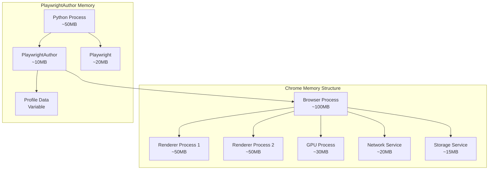

# Memory Management Guide

This guide explains how to manage memory effectively when using PlaywrightAuthor for browser automation.

## Understanding Memory Usage

### Memory Components



### Memory Growth Patterns

```python
import psutil
import matplotlib.pyplot as plt
from datetime import datetime

class MemoryTracker:
    """Track memory usage over time."""
    
    def __init__(self):
        self.timestamps = []
        self.memory_usage = []
        self.process = psutil.Process()
    
    def record(self):
        """Record current memory usage."""
        self.timestamps.append(datetime.now())
        self.memory_usage.append(self.process.memory_info().rss / 1024 / 1024)
    
    def plot(self, title="Memory Usage Over Time"):
        """Plot memory usage graph."""
        plt.figure(figsize=(12, 6))
        plt.plot(self.timestamps, self.memory_usage, 'b-', linewidth=2)
        plt.xlabel('Time')
        plt.ylabel('Memory (MB)')
        plt.title(title)
        plt.grid(True, alpha=0.3)
        plt.tight_layout()
        plt.show()
    
    def get_statistics(self):
        """Get memory statistics."""
        if not self.memory_usage:
            return {}
        
        return {
            'min_mb': min(self.memory_usage),
            'max_mb': max(self.memory_usage),
            'avg_mb': sum(self.memory_usage) / len(self.memory_usage),
            'growth_mb': self.memory_usage[-1] - self.memory_usage[0],
            'samples': len(self.memory_usage)
        }

# Track memory during automation
tracker = MemoryTracker()

with Browser() as browser:
    tracker.record()  # Initial
    
    for i in range(10):
        page = browser.new_page()
        tracker.record()  # After page creation
        
        page.goto("https://example.com")
        tracker.record()  # After navigation
        
        page.close()
        tracker.record()  # After cleanup

# Analyze results
stats = tracker.get_statistics()
print(f"Memory grew by {stats['growth_mb']:.2f}MB")
tracker.plot()
```

## Memory Optimization Techniques

### 1. Page Lifecycle Management

```python
from contextlib import contextmanager
import weakref

class PageManager:
    """Manage page lifecycle for memory efficiency."""
    
    def __init__(self, browser, max_pages: int = 5):
        self.browser = browser
        self.max_pages = max_pages
        self.pages = weakref.WeakSet()
        self.page_data = {}
    
    @contextmanager
    def create_page(self, page_id: str = None):
        """Create managed page."""
        # Clean up if at limit
        if len(self.pages) >= self.max_pages:
            self._cleanup_oldest()
        
        page = self.browser.new_page()
        self.pages.add(page)
        
        if page_id:
            self.page_data[page_id] = {
                'created': datetime.now(),
                'page': weakref.ref(page)
            }
        
        try:
            yield page
        finally:
            # Always close page
            if not page.is_closed():
                page.close()
            
            # Remove from tracking
            self.pages.discard(page)
            if page_id and page_id in self.page_data:
                del self.page_data[page_id]
    
    def _cleanup_oldest(self):
        """Close oldest pages."""
        # Sort by creation time
        sorted_pages = sorted(
            self.page_data.items(),
            key=lambda x: x[1]['created']
        )
        
        # Close oldest
        if sorted_pages:
            oldest_id, oldest_data = sorted_pages[0]
            page_ref = oldest_data['page']
            page = page_ref()
            
            if page and not page.is_closed():
                page.close()
            
            del self.page_data[oldest_id]

# Usage
with Browser() as browser:
    manager = PageManager(browser, max_pages=3)
    
    # Pages are automatically managed
    with manager.create_page("page1") as page:
        page.goto("https://example.com")
        # Page auto-closes after block
    
    # Old pages cleaned up automatically
    for i in range(10):
        with manager.create_page(f"page{i}") as page:
            page.goto("https://example.com")
```

### 2. Resource Blocking

```python
class ResourceBlocker:
    """Block memory-heavy resources."""
    
    BLOCK_PATTERNS = {
        'images': ['*.jpg', '*.jpeg', '*.png', '*.gif', '*.webp', '*.svg', '*.ico'],
        'media': ['*.mp4', '*.webm', '*.mp3', '*.wav', '*.flac'],
        'fonts': ['*.woff', '*.woff2', '*.ttf', '*.otf'],
        'styles': ['*.css'],
        'scripts': ['*.js'],
    }
    
    @staticmethod
    def apply_blocking(page, block_types: list = None):
        """Apply resource blocking to page."""
        if block_types is None:
            block_types = ['images', 'media', 'fonts']
        
        # Build pattern list
        patterns = []
        for block_type in block_types:
            patterns.extend(ResourceBlocker.BLOCK_PATTERNS.get(block_type, []))
        
        # Block matching resources
        def handle_route(route):
            if any(route.request.url.endswith(pattern.replace('*', '')) 
                   for pattern in patterns):
                route.abort()
            else:
                route.continue_()
        
        page.route("**/*", handle_route)
        
        # Also block by resource type
        page.route("**/*", lambda route: route.abort() 
                   if route.request.resource_type in block_types 
                   else route.continue_())

# Usage
with Browser() as browser:
    page = browser.new_page()
    
    # Block memory-heavy resources
    ResourceBlocker.apply_blocking(page, ['images', 'media', 'fonts'])
    
    # Page loads much faster and uses less memory
    page.goto("https://heavy-website.com")
```

### 3. Cache Management

```python
import shutil
from pathlib import Path

class CacheManager:
    """Manage browser cache for memory efficiency."""
    
    def __init__(self, cache_dir: Path, max_size_mb: int = 100):
        self.cache_dir = Path(cache_dir)
        self.max_size_mb = max_size_mb
    
    def get_cache_size(self) -> float:
        """Get current cache size in MB."""
        if not self.cache_dir.exists():
            return 0
        
        total_size = 0
        for file in self.cache_dir.rglob('*'):
            if file.is_file():
                total_size += file.stat().st_size
        
        return total_size / 1024 / 1024
    
    def clean_cache(self, keep_recent: bool = True):
        """Clean cache to free memory."""
        if not self.cache_dir.exists():
            return
        
        current_size = self.get_cache_size()
        print(f"Cache size before cleaning: {current_size:.2f}MB")
        
        if keep_recent:
            # Remove old files first
            files = []
            for file in self.cache_dir.rglob('*'):
                if file.is_file():
                    files.append((file, file.stat().st_mtime))
            
            # Sort by modification time
            files.sort(key=lambda x: x[1])
            
            # Remove oldest files until under limit
            removed_size = 0
            for file, _ in files:
                if current_size - removed_size < self.max_size_mb:
                    break
                
                file_size = file.stat().st_size
                file.unlink()
                removed_size += file_size / 1024 / 1024
        else:
            # Clear entire cache
            shutil.rmtree(self.cache_dir)
            self.cache_dir.mkdir(parents=True, exist_ok=True)
        
        new_size = self.get_cache_size()
        print(f"Cache size after cleaning: {new_size:.2f}MB")
        print(f"Freed: {current_size - new_size:.2f}MB")

# Usage
from playwrightauthor.utils.paths import cache_dir

cache_manager = CacheManager(cache_dir(), max_size_mb=50)

# Check and clean cache periodically
if cache_manager.get_cache_size() > 50:
    cache_manager.clean_cache()
```

### 4. Memory-Aware Automation

```python
class MemoryAwareAutomation:
    """Automation that adapts based on memory usage."""
    
    def __init__(self, memory_threshold_mb: int = 1024):
        self.memory_threshold_mb = memory_threshold_mb
        self.process = psutil.Process()
        self.gc_frequency = 10  # GC every N operations
        self.operation_count = 0
    
    def check_memory(self) -> dict:
        """Check current memory status."""
        memory_info = self.process.memory_info()
        return {
            'rss_mb': memory_info.rss / 1024 / 1024,
            'vms_mb': memory_info.vms / 1024 / 1024,
            'percent': self.process.memory_percent(),
            'available_mb': psutil.virtual_memory().available / 1024 / 1024
        }
    
    def should_optimize(self) -> bool:
        """Check if memory optimization needed."""
        status = self.check_memory()
        return status['rss_mb'] > self.memory_threshold_mb
    
    def optimize_memory(self):
        """Perform memory optimization."""
        import gc
        
        # Force garbage collection
        gc.collect()
        gc.collect()  # Second pass for cyclic references
        
        # Clear caches
        if hasattr(self, 'browser'):
            for page in self.browser.pages:
                page.evaluate("() => { window.gc && window.gc(); }")
    
    def run_with_memory_management(self, operation):
        """Run operation with memory management."""
        self.operation_count += 1
        
        # Check memory before operation
        if self.should_optimize():
            print(f"Memory threshold exceeded, optimizing...")
            self.optimize_memory()
        
        # Run operation
        result = operation()
        
        # Periodic GC
        if self.operation_count % self.gc_frequency == 0:
            gc.collect()
        
        return result

# Usage
automation = MemoryAwareAutomation(memory_threshold_mb=800)

with Browser() as browser:
    automation.browser = browser
    
    def process_page(url):
        page = browser.new_page()
        page.goto(url)
        data = page.evaluate("() => document.title")
        page.close()
        return data
    
    # Process pages with memory management
    urls = ["https://example.com"] * 100
    results = []
    
    for url in urls:
        result = automation.run_with_memory_management(
            lambda: process_page(url)
        )
        results.append(result)
        
        # Print memory status periodically
        if len(results) % 10 == 0:
            status = automation.check_memory()
            print(f"Processed {len(results)} pages, Memory: {status['rss_mb']:.2f}MB")
```

## Memory Leak Prevention

### Common Memory Leak Sources

1. **Unclosed Pages**
   ```python
   # BAD - Memory leak
   pages = []
   for url in urls:
       page = browser.new_page()
       page.goto(url)
       pages.append(page)  # Pages never closed
   
   # GOOD - Proper cleanup
   for url in urls:
       page = browser.new_page()
       page.goto(url)
       # Process page
       page.close()  # Always close
   ```

2. **Event Listeners**
   ```python
   # BAD - Accumulating listeners
   def add_listener(page):
       page.on("console", lambda msg: print(msg))
   
   for _ in range(100):
       add_listener(page)  # 100 listeners!
   
   # GOOD - Remove listeners
   def process_with_listener(page):
       def console_handler(msg):
           print(msg)
       
       page.on("console", console_handler)
       # Process page
       page.remove_listener("console", console_handler)
   ```

3. **Large Data Retention**
   ```python
   # BAD - Keeping all data in memory
   all_data = []
   for url in urls:
       page = browser.new_page()
       data = page.evaluate("() => document.body.innerHTML")
       all_data.append(data)  # Accumulating large strings
       page.close()
   
   # GOOD - Process and discard
   def process_data(data):
       # Process immediately
       return len(data)  # Return only what's needed
   
   results = []
   for url in urls:
       page = browser.new_page()
       data = page.evaluate("() => document.body.innerHTML")
       result = process_data(data)
       results.append(result)  # Store only small results
       page.close()
   ```

### Memory Leak Detector

```python
import tracemalloc
import linecache
import os

class MemoryLeakDetector:
    """Advanced memory leak detection."""
    
    def __init__(self, top_n: int = 10):
        self.top_n = top_n
        tracemalloc.start()
        self.baseline = None
    
    def take_baseline(self):
        """Take baseline snapshot."""
        self.baseline = tracemalloc.take_snapshot()
    
    def check_for_leaks(self) -> list:
        """Check for memory leaks."""
        if not self.baseline:
            raise ValueError("No baseline snapshot taken")
        
        current = tracemalloc.take_snapshot()
        top_stats = current.compare_to(self.baseline, 'lineno')
        
        leaks = []
        for stat in top_stats[:self.top_n]:
            if stat.size_diff > 1024 * 1024:  # > 1MB growth
                # Get source code line
                filename = stat.traceback[0].filename
                lineno = stat.traceback[0].lineno
                line = linecache.getline(filename, lineno).strip()
                
                leaks.append({
                    'file': os.path.basename(filename),
                    'line': lineno,
                    'code': line,
                    'size_diff_mb': stat.size_diff / 1024 / 1024,
                    'count_diff': stat.count_diff
                })
        
        return leaks
    
    def print_report(self):
        """Print leak detection report."""
        leaks = self.check_for_leaks()
        
        if not leaks:
            print("No significant memory leaks detected")
            return
        
        print("Potential memory leaks detected:")
        for leak in leaks:
            print(f"\n{leak['file']}:{leak['line']}")
            print(f"   Code: {leak['code']}")
            print(f"   Growth: +{leak['size_diff_mb']:.2f}MB ({leak['count_diff']:+d} objects)")

# Usage
detector = MemoryLeakDetector()
detector.take_baseline()

# Run automation
with Browser() as browser:
    for i in range(50):
        page = browser.new_page()
        page.goto("https://example.com")
        # Intentionally not closing some pages to create leak
        if i % 10 != 0:
            page.close()

# Check for leaks
detector.print_report()
```

## Memory Monitoring Tools

### Real-time Memory Monitor

```python
import threading
import time
from collections import deque

class RealTimeMemoryMonitor:
    """Monitor memory usage in real-time."""
    
    def __init__(self, window_size: int = 60):
        self.window_size = window_size
        self.memory_history = deque(maxlen=window_size)
        self.running = False
        self.alert_threshold_mb = 1024
        self.process = psutil.Process()
    
    def start_monitoring(self):
        """Start monitoring in background."""
        self.running = True
        monitor_thread = threading.Thread(target=self._monitor_loop)
        monitor_thread.daemon = True
        monitor_thread.start()
    
    def stop_monitoring(self):
        """Stop monitoring."""
        self.running = False
    
    def _monitor_loop(self):
        """Monitor loop."""
        while self.running:
            memory_mb = self.process.memory_info().rss / 1024 / 1024
            self.memory_history.append({
                'timestamp': time.time(),
                'memory_mb': memory_mb
            })
            
            # Check for alerts
            if memory_mb > self.alert_threshold_mb:
                self._trigger_alert(memory_mb)
            
            time.sleep(1)
    
    def _trigger_alert(self, memory_mb: float):
        """Trigger memory alert."""
        print(f"MEMORY ALERT: {memory_mb:.2f}MB exceeds threshold of {self.alert_threshold_mb}MB")
    
    def get_statistics(self) -> dict:
        """Get memory statistics."""
        if not self.memory_history:
            return {}
        
        memory_values = [h['memory_mb'] for h in self.memory_history]
        
        return {
            'current_mb': memory_values[-1] if memory_values else 0,
            'min_mb': min(memory_values),
            'max_mb': max(memory_values),
            'avg_mb': sum(memory_values) / len(memory_values),
            'trend': 'increasing' if memory_values[-1] > memory_values[0] else 'decreasing'
        }

# Usage
monitor = RealTimeMemoryMonitor()
monitor.alert_threshold_mb = 800
monitor.start_monitoring()

try:
    with Browser() as browser:
        # Your automation code
        for i in range(30):
            page = browser.new_page()
            page.goto("https://example.com")
            
            # Check memory stats
            if i % 10 == 0:
                stats = monitor.get_statistics()
                print(f"\nMemory Stats after {i} pages:")
                print(f"  Current: {stats.get('current_mb', 0):.2f}MB")
                print(f"  Average: {stats.get('avg_mb', 0):.2f}MB")
                print(f"  Trend: {stats.get('trend', 'unknown')}")
            
            time.sleep(1)
            page.close()

finally:
    monitor.stop_monitoring()
```

## Memory Best Practices

1. **Always Close Resources**
   - Close pages when done
   - Close contexts when done
   - Remove event listeners

2. **Limit Concurrent Operations**
   - Control number of open pages
   - Batch operations
   - Use page recycling

3. **Block Unnecessary Resources**
   - Images and media
   - Fonts and stylesheets
   - Third-party scripts

4. **Monitor Memory Usage**
   - Set up alerts
   - Track trends
   - Profile memory hotspots

5. **Implement Cleanup Strategies**
   - Periodic garbage collection
   - Cache clearing
   - Profile rotation

## Additional Resources

- [Performance Optimization](index.md)
- [Connection Pooling](connection-pooling.md)
- [Resource Management](../architecture/components.md#resource-management)
- [Chrome Memory Profiling](https://developer.chrome.com/docs/devtools/memory-problems/)