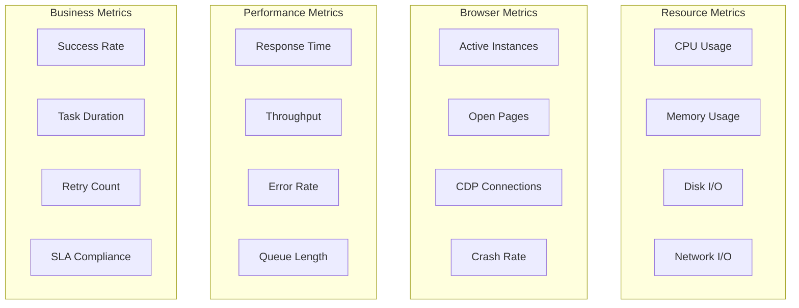

# Performance Monitoring Guide

This guide covers monitoring strategies for PlaywrightAuthor, including metrics collection, alerting, debugging, and production monitoring.

## Monitoring Overview

Effective monitoring helps you:
- Detect issues before they impact users
- Optimize performance by finding bottlenecks
- Track automation usage patterns
- Maintain system reliability

## Key Metrics to Monitor

### System Metrics



### Metric Collection Implementation

```python
from dataclasses import dataclass, field
from typing import Dict, List, Optional
import time
import psutil
import statistics
from datetime import datetime, timedelta
from collections import defaultdict, deque

@dataclass
class MetricPoint:
    """Single metric data point."""
    name: str
    value: float
    timestamp: float = field(default_factory=time.time)
    tags: Dict[str, str] = field(default_factory=dict)
    
@dataclass
class MetricSummary:
    """Summary statistics for a metric."""
    name: str
    count: int
    mean: float
    median: float
    min: float
    max: float
    p95: float
    p99: float
    std_dev: float

class MetricsCollector:
    """Comprehensive metrics collection system."""
    
    def __init__(self, window_size: int = 300):  # 5-minute window
        self.window_size = window_size
        self.metrics: Dict[str, deque] = defaultdict(lambda: deque(maxlen=1000))
        self.counters: Dict[str, int] = defaultdict(int)
        self.gauges: Dict[str, float] = {}
        self.histograms: Dict[str, List[float]] = defaultdict(list)
        
        # System monitoring
        self.process = psutil.Process()
        
    def record_counter(self, name: str, value: int = 1, tags: Dict[str, str] = None):
        """Record counter metric (cumulative)."""
        self.counters[name] += value
        
        metric = MetricPoint(name, self.counters[name], tags=tags or {})
        self.metrics[name].append(metric)
    
    def record_gauge(self, name: str, value: float, tags: Dict[str, str] = None):
        """Record gauge metric (point-in-time)."""
        self.gauges[name] = value
        
        metric = MetricPoint(name, value, tags=tags or {})
        self.metrics[name].append(metric)
    
    def record_histogram(self, name: str, value: float, tags: Dict[str, str] = None):
        """Record histogram metric (distribution)."""
        self.histograms[name].append(value)
        
        # Keep only recent values
        cutoff_time = time.time() - self.window_size
        self.histograms[name] = [
            v for i, v in enumerate(self.histograms[name])
            if i > len(self.histograms[name]) - 1000
        ]
        
        metric = MetricPoint(name, value, tags=tags or {})
        self.metrics[name].append(metric)
    
    def record_timing(self, name: str, duration: float, tags: Dict[str, str] = None):
        """Record timing metric."""
        self.record_histogram(f"{name}.duration", duration, tags)
    
    def get_summary(self, name: str) -> Optional[MetricSummary]:
        """Get summary statistics for a metric."""
        if name in self.histograms and self.histograms[name]:
            values = self.histograms[name]
        elif name in self.metrics and self.metrics[name]:
            values = [m.value for m in self.metrics[name]]
        else:
            return None
        
        if not values:
            return None
        
        sorted_values = sorted(values)
        
        return MetricSummary(
            name=name,
            count=len(values),
            mean=statistics.mean(values),
            median=statistics.median(values),
            min=min(values),
            max=max(values),
            p95=sorted_values[int(len(sorted_values) * 0.95)],
            p99=sorted_values[int(len(sorted_values) * 0.99)],
            std_dev=statistics.stdev(values) if len(values) > 1 else 0
        )
    
    def collect_system_metrics(self):
        """Collect system resource metrics."""
        # CPU metrics
        cpu_percent = self.process.cpu_percent(interval=0.1)
        self.record_gauge("system.cpu.percent", cpu_percent)
        
        # Memory metrics
        memory_info = self.process.memory_info()
        self.record_gauge("system.memory.rss_mb", memory_info.rss / 1024 / 1024)
        self.record_gauge("system.memory.vms_mb", memory_info.vms / 1024 / 1024)
        self.record_gauge("system.memory.percent", self.process.memory_percent())
        
        # Thread count
        self.record_gauge("system.threads", self.process.num_threads())
        
        # File descriptors (Unix)
        try:
            self.record_gauge("system.fds", self.process.num_fds())
        except AttributeError:
            pass  # Not available on Windows
        
        # Chrome process count
        chrome_count = sum(
            1 for p in psutil.process_iter(['name'])
            if 'chrome' in p.info['name'].lower()
        )
        self.record_gauge("browser.process_count", chrome_count)

# Global metrics instance
metrics = MetricsCollector()
```

## Monitoring Decorators

### Performance Monitoring Decorators

```python
from functools import wraps
import asyncio
from contextlib import contextmanager

def monitor_performance(metric_name: str = None):
    """Decorator to monitor function performance."""
    def decorator(func):
        name = metric_name or f"{func.__module__}.{func.__name__}"
        
        @wraps(func)
        def sync_wrapper(*args, **kwargs):
            start_time = time.time()
            error = None
            
            try:
                result = func(*args, **kwargs)
                metrics.record_counter(f"{name}.success")
                return result
            
            except Exception as e:
                error = e
                metrics.record_counter(f"{name}.error")
                metrics.record_counter(f"{name}.error.{type(e).__name__}")
                raise
            
            finally:
                duration = time.time() - start_time
                metrics.record_timing(name, duration * 1000)  # Convert to ms
                
                if error:
                    metrics.record_counter(f"{name}.total")
        
        @wraps(func)
        async def async_wrapper(*args, **kwargs):
            start_time = time.time()
            error = None
            
            try:
                result = await func(*args, **kwargs)
                metrics.record_counter(f"{name}.success")
                return result
            
            except Exception as e:
                error = e
                metrics.record_counter(f"{name}.error")
                metrics.record_counter(f"{name}.error.{type(e).__name__}")
                raise
            
            finally:
                duration = time.time() - start_time
                metrics.record_timing(name, duration * 1000)
                
                if error:
                    metrics.record_counter(f"{name}.total")
        
        return async_wrapper if asyncio.iscoroutinefunction(func) else sync_wrapper
    
    return decorator

@contextmanager
def monitor_operation(name: str, tags: Dict[str, str] = None):
    """Context manager for monitoring operations."""
    start_time = time.time()
    error = None
    
    metrics.record_counter(f"{name}.started", tags=tags)
    
    try:
        yield
        metrics.record_counter(f"{name}.success", tags=tags)
    
    except Exception as e:
        error = e
        metrics.record_counter(f"{name}.error", tags=tags)
        metrics.record_counter(f"{name}.error.{type(e).__name__}", tags=tags)
        raise
    
    finally:
        duration = time.time() - start_time
        metrics.record_timing(name, duration * 1000, tags=tags)
        metrics.record_counter(f"{name}.completed", tags=tags)

# Usage examples
@monitor_performance()
def fetch_page(url: str):
    with Browser() as browser:
        page = browser.new_page()
        page.goto(url)
        return page.title()

@monitor_performance("custom.metric.name")
async def async_operation():
    await asyncio.sleep(1)
    return "Done"

# Context manager usage
with monitor_operation("batch_processing", tags={"batch_id": "123"}):
    # Process batch
    pass
```

## Real-time Monitoring Dashboard

### Terminal Dashboard

```python
from rich.console import Console
from rich.table import Table
from rich.live import Live
from rich.layout import Layout
from rich.panel import Panel
from rich.progress import Progress, SpinnerColumn, TextColumn
import threading

class MonitoringDashboard:
    """Real-time monitoring dashboard in terminal."""
    
    def __init__(self, metrics_collector: MetricsCollector):
        self.metrics = metrics_collector
        self.console = Console()
        self.running = False
        
    def create_layout(self) -> Layout:
        """Create dashboard layout."""
        layout = Layout()
        
        layout.split(
            Layout(name="header", size=3),
            Layout(name="body"),
            Layout(name="footer", size=3)
        )
        
        layout["body"].split_row(
            Layout(name="left"),
            Layout(name="right")
        )
        
        layout["left"].split(
            Layout(name="system"),
            Layout(name="browser")
        )
        
        layout["right"].split(
            Layout(name="performance"),
            Layout(name="errors")
        )
        
        return layout
    
    def create_system_panel(self) -> Panel:
        """Create system metrics panel."""
        # Collect current metrics
        self.metrics.collect_system_metrics()
        
        table = Table(show_header=False, expand=True)
        table.add_column("Metric", style="cyan")
        table.add_column("Value", style="green")
        
        # Add system metrics
        cpu = self.metrics.gauges.get("system.cpu.percent", 0)
        memory = self.metrics.gauges.get("system.memory.rss_mb", 0)
        threads = self.metrics.gauges.get("system.threads", 0)
        
        table.add_row("CPU Usage", f"{cpu:.1f}%")
        table.add_row("Memory", f"{memory:.1f} MB")
        table.add_row("Threads", str(int(threads)))
        
        # Add Chrome metrics
        chrome_count = self.metrics.gauges.get("browser.process_count", 0)
        table.add_row("Chrome Processes", str(int(chrome_count)))
        
        return Panel(table, title="System Metrics", border_style="blue")
    
    def create_performance_panel(self) -> Panel:
        """Create performance metrics panel."""
        table = Table(show_header=True, expand=True)
        table.add_column("Operation", style="cyan")
        table.add_column("Count", style="yellow")
        table.add_column("Avg (ms)", style="green")
        table.add_column("P95 (ms)", style="orange")
        
        # Get timing metrics
        for name, values in self.metrics.histograms.items():
            if name.endswith(".duration") and values:
                op_name = name.replace(".duration", "")
                summary = self.metrics.get_summary(name)
                
                if summary:
                    table.add_row(
                        op_name,
                        str(summary.count),
                        f"{summary.mean:.1f}",
                        f"{summary.p95:.1f}"
                    )
        
        return Panel(table, title="Performance Metrics", border_style="green")
    
    def create_error_panel(self) -> Panel:
        """Create error metrics panel."""
        table = Table(show_header=True, expand=True)
        table.add_column("Error Type", style="red")
        table.add_column("Count", style="yellow")
        table.add_column("Rate", style="orange")
        
        # Get error metrics
        total_errors = 0
        error_types = {}
        
        for name, value in self.metrics.counters.items():
            if ".error." in name:
                error_type = name.split(".")[-1]
                error_types[error_type] = error_types.get(error_type, 0) + value
                total_errors += value
        
        # Calculate rates
        for error_type, count in error_types.items():
            rate = (count / total_errors * 100) if total_errors > 0 else 0
            table.add_row(error_type, str(count), f"{rate:.1f}%")
        
        return Panel(table, title="Error Metrics", border_style="red")
    
    def update_display(self, layout: Layout):
        """Update dashboard display."""
        layout["header"].update(
            Panel(
                f"[bold blue]PlaywrightAuthor Monitoring Dashboard[/bold blue] - {datetime.now().strftime('%Y-%m-%d %H:%M:%S')}",
                style="white on blue"
            )
        )
        
        layout["system"].update(self.create_system_panel())
        layout["performance"].update(self.create_performance_panel())
        layout["errors"].update(self.create_error_panel())
        
        # Browser status
        browser_status = Table(show_header=False)
        browser_status.add_column("Status", style="cyan")
        browser_status.add_column("Value", style="green")
        
        active_browsers = self.metrics.gauges.get("browser.active", 0)
        idle_browsers = self.metrics.gauges.get("browser.idle", 0)
        
        browser_status.add_row("Active Browsers", str(int(active_browsers)))
        browser_status.add_row("Idle Browsers", str(int(idle_browsers)))
        
        layout["browser"].update(
            Panel(browser_status, title="Browser Status", border_style="yellow")
        )
        
        layout["footer"].update(
            Panel(
                "[dim]Press Ctrl+C to exit[/dim]",
                style="white on black"
            )
        )
    
    def run(self):
        """Run the dashboard."""
        self.running = True
        layout = self.create_layout()
        
        with Live(layout, refresh_per_second=1, screen=True) as live:
            while self.running:
                self.update_display(layout)
                time.sleep(1)
    
    def stop(self):
        """Stop the dashboard."""
        self.running = False

# Usage
dashboard = MonitoringDashboard(metrics)

# Run in separate thread
dashboard_thread = threading.Thread(target=dashboard.run)
dashboard_thread.daemon = True
dashboard_thread.start()

# Your automation code here...
# dashboard.stop() when done
```

## Alerting System

### Alert Configuration

```python
from enum import Enum
from typing import Callable, Optional
import smtplib
from email.mime.text import MIMEText

class AlertSeverity(Enum):
    INFO = "info"
    WARNING = "warning"
    ERROR = "error"
    CRITICAL = "critical"

@dataclass
class Alert:
    """Alert definition."""
    name: str
    condition: str
    threshold: float
    severity: AlertSeverity
    message_template: str
    cooldown_seconds: int = 300
    
@dataclass
class AlertEvent:
    """Alert event instance."""
    alert: Alert
    value: float
    timestamp: float
    message: str

class AlertManager:
    """Manage monitoring alerts."""
    
    def __init__(self, metrics_collector: MetricsCollector):
        self.metrics = metrics_collector
        self.alerts: List[Alert] = []
        self.alert_history: Dict[str, float] = {}
        self.handlers: List[Callable[[AlertEvent], None]] = []
        
    def add_alert(self, alert: Alert):
        """Add alert definition."""
        self.alerts.append(alert)
    
    def add_handler(self, handler: Callable[[AlertEvent], None]):
        """Add alert handler."""
        self.handlers.append(handler)
    
    def check_alerts(self):
        """Check all alert conditions."""
        current_time = time.time()
        
        for alert in self.alerts:
            # Check cooldown
            last_alert = self.alert_history.get(alert.name, 0)
            if current_time - last_alert < alert.cooldown_seconds:
                continue
            
            # Evaluate condition
            value = self._evaluate_condition(alert.condition)
            
            if value is not None and value > alert.threshold:
                # Trigger alert
                event = AlertEvent(
                    alert=alert,
                    value=value,
                    timestamp=current_time,
                    message=alert.message_template.format(
                        value=value,
                        threshold=alert.threshold,
                        name=alert.name
                    )
                )
                
                self._trigger_alert(event)
                self.alert_history[alert.name] = current_time
    
    def _evaluate_condition(self, condition: str) -> Optional[float]:
        """Evaluate alert condition."""
        # Simple condition evaluation
        if condition.startswith("gauge:"):
            metric_name = condition.replace("gauge:", "")
            return self.metrics.gauges.get(metric_name)
        
        elif condition.startswith("rate:"):
            metric_name = condition.replace("rate:", "")
            # Calculate rate over last minute
            if metric_name in self.metrics.metrics:
                recent = [
                    m for m in self.metrics.metrics[metric_name]
                    if m.timestamp > time.time() - 60
                ]
                return len(recent) / 60 if recent else 0
        
        elif condition.startswith("p95:"):
            metric_name = condition.replace("p95:", "")
            summary = self.metrics.get_summary(metric_name)
            return summary.p95 if summary else None
        
        return None
    
    def _trigger_alert(self, event: AlertEvent):
        """Trigger alert handlers."""
        for handler in self.handlers:
            try:
                handler(event)
            except Exception as e:
                print(f"Alert handler error: {e}")

# Alert handlers
def console_alert_handler(event: AlertEvent):
    """Print alerts to console."""
    severity_colors = {
        AlertSeverity.INFO: "blue",
        AlertSeverity.WARNING: "yellow",
        AlertSeverity.ERROR: "red",
        AlertSeverity.CRITICAL: "red bold"
    }
    
    color = severity_colors.get(event.alert.severity, "white")
    timestamp = datetime.fromtimestamp(event.timestamp).strftime("%H:%M:%S")
    
    print(f"[{color}][{timestamp}] {event.alert.severity.value.upper()}: {event.message}[/{color}]")

def email_alert_handler(event: AlertEvent, smtp_config: dict):
    """Send email alerts."""
    if event.alert.severity not in [AlertSeverity.ERROR, AlertSeverity.CRITICAL]:
        return
    
    msg = MIMEText(f"""
    Alert: {event.alert.name}
    Severity: {event.alert.severity.value}
    Time: {datetime.fromtimestamp(event.timestamp)}
    
    {event.message}
    
    Current Value: {event.value}
    Threshold: {event.alert.threshold}
    """)
    
    msg['Subject'] = f"[{event.alert.severity.value.upper()}] {event.alert.name}"
    msg['From'] = smtp_config['from']
    msg['To'] = smtp_config['to']
    
    with smtplib.SMTP(smtp_config['host'], smtp_config['port']) as server:
        if smtp_config.get('use_tls'):
            server.starttls()
        if smtp_config.get('username'):
            server.login(smtp_config['username'], smtp_config['password'])
        server.send_message(msg)

# Configure alerts
alert_manager = AlertManager(metrics)

# Add alert definitions
alert_manager.add_alert(Alert(
    name="high_memory_usage",
    condition="gauge:system.memory.percent",
    threshold=80.0,
    severity=AlertSeverity.WARNING,
    message_template="Memory usage {value:.1f}% exceeds threshold {threshold}%"
))

alert_manager.add_alert(Alert(
    name="high_error_rate",
    condition="rate:page.load.error",
    threshold=0.1,  # 10% error rate
    severity=AlertSeverity.ERROR,
    message_template="Error rate {value:.2f} exceeds threshold {threshold}"
))

alert_manager.add_alert(Alert(
    name="slow_response_time",
    condition="p95:page.load.duration",
    threshold=5000,  # 5 seconds
    severity=AlertSeverity.WARNING,
    message_template="P95 response time {value:.0f}ms exceeds {threshold}ms"
))

# Add handlers
alert_manager.add_handler(console_alert_handler)

# Start alert checking
def alert_check_loop():
    while True:
        alert_manager.check_alerts()
        time.sleep(10)  # Check every 10 seconds

alert_thread = threading.Thread(target=alert_check_loop)
alert_thread.daemon = True
alert_thread.start()
```

## Production Monitoring Integration

### Prometheus Exporter

```python
from prometheus_client import Counter, Gauge, Histogram, Summary
from prometheus_client import start_http_server, generate_latest
import prometheus_client

class PrometheusExporter:
    """Export metrics to Prometheus."""
    
    def __init__(self, metrics_collector: MetricsCollector, port: int = 8000):
        self.metrics = metrics_collector
        self.port = port
        
        # Define Prometheus metrics
        self.prom_counters = {}
        self.prom_gauges = {}
        self.prom_histograms = {}
        
        # System metrics
        self.cpu_gauge = Gauge('playwrightauthor_cpu_percent', 'CPU usage percentage')
        self.memory_gauge = Gauge('playwrightauthor_memory_mb', 'Memory usage in MB')
        self.threads_gauge = Gauge('playwrightauthor_threads', 'Number of threads')
        
        # Browser metrics
        self.browser_gauge = Gauge('playwrightauthor_browsers_total', 'Total browser instances')
        self.page_gauge = Gauge('playwrightauthor_pages_total', 'Total pages open')
        
        # Performance metrics
        self.request_duration = Histogram(
            'playwrightauthor_request_duration_seconds',
            'Request duration in seconds',
            ['operation']
        )
        
        self.error_counter = Counter(
            'playwrightauthor_errors_total',
            'Total errors',
            ['error_type']
        )
    
    def update_metrics(self):
        """Update Prometheus metrics from collector."""
        # Update system metrics
        self.cpu_gauge.set(self.metrics.gauges.get('system.cpu.percent', 0))
        self.memory_gauge.set(self.metrics.gauges.get('system.memory.rss_mb', 0))
        self.threads_gauge.set(self.metrics.gauges.get('system.threads', 0))
        
        # Update browser metrics
        self.browser_gauge.set(self.metrics.gauges.get('browser.process_count', 0))
        
        # Update performance metrics
        for name, values in self.metrics.histograms.items():
            if name.endswith('.duration') and values:
                op_name = name.replace('.duration', '')
                
                # Create histogram if not exists
                if op_name not in self.prom_histograms:
                    self.prom_histograms[op_name] = Histogram(
                        f'playwrightauthor_{op_name}_duration_ms',
                        f'{op_name} duration in milliseconds'
                    )
                
                # Add recent values
                for value in values[-100:]:  # Last 100 values
                    self.prom_histograms[op_name].observe(value)
    
    def start(self):
        """Start Prometheus exporter."""
        # Start HTTP server
        start_http_server(self.port)
        
        # Update loop
        def update_loop():
            while True:
                self.update_metrics()
                time.sleep(10)
        
        update_thread = threading.Thread(target=update_loop)
        update_thread.daemon = True
        update_thread.start()
        
        print(f"Prometheus metrics available at http://localhost:{self.port}/metrics")

# Start Prometheus exporter
exporter = PrometheusExporter(metrics, port=8000)
exporter.start()
```

### OpenTelemetry Integration

```python
from opentelemetry import trace, metrics as otel_metrics
from opentelemetry.exporter.otlp.proto.grpc.trace_exporter import OTLPSpanExporter
from opentelemetry.exporter.otlp.proto.grpc.metric_exporter import OTLPMetricExporter
from opentelemetry.sdk.trace import TracerProvider
from opentelemetry.sdk.trace.export import BatchSpanProcessor
from opentelemetry.sdk.metrics import MeterProvider
from opentelemetry.sdk.metrics.export import PeriodicExportingMetricReader

def setup_opentelemetry(service_name: str = "playwrightauthor"):
    """Setup OpenTelemetry instrumentation."""
    
    # Setup tracing
    trace.set_tracer_provider(TracerProvider())
    tracer = trace.get_tracer(service_name)
    
    # Add OTLP exporter
    otlp_exporter = OTLPSpanExporter(
        endpoint="localhost:4317",
        insecure=True
    )
    
    span_processor = BatchSpanProcessor(otlp_exporter)
    trace.get_tracer_provider().add_span_processor(span_processor)
    
    # Setup metrics
    metric_reader = PeriodicExportingMetricReader(
        exporter=OTLPMetricExporter(endpoint="localhost:4317"),
        export_interval_millis=10000
    )
    
    provider = MeterProvider(metric_readers=[metric_reader])
    otel_metrics.set_meter_provider(provider)
    meter = otel_metrics.get_meter(service_name)
    
    return tracer, meter

# Use OpenTelemetry
tracer, meter = setup_opentelemetry()

# Create metrics
page_counter = meter.create_counter(
    "pages_processed",
    description="Number of pages processed"
)

response_time_histogram = meter.create_histogram(
    "response_time",
    description="Response time in milliseconds"
)

# Instrumented function
def process_page_with_telemetry(url: str):
    with tracer.start_as_current_span("process_page") as span:
        span.set_attribute("url", url)
        
        start_time = time.time()
        
        try:
            with Browser() as browser:
                page = browser.new_page()
                page.goto(url)
                title = page.title()
                page.close()
                
            # Record success
            span.set_attribute("success", True)
            page_counter.add(1, {"status": "success"})
            
            return title
            
        except Exception as e:
            # Record error
            span.set_attribute("success", False)
            span.record_exception(e)
            page_counter.add(1, {"status": "error"})
            raise
            
        finally:
            # Record timing
            duration = (time.time() - start_time) * 1000
            response_time_histogram.record(duration, {"url": url})
```

## Debug Monitoring

### Chrome DevTools Protocol Monitoring

```python
class CDPMonitor:
    """Monitor Chrome DevTools Protocol events."""
    
    def __init__(self):
        self.events = deque(maxlen=1000)
        self.event_counts = defaultdict(int)
        
    def setup_cdp_monitoring(self, page):
        """Setup CDP event monitoring for a page."""
        client = page.context._browser._connection._transport._ws
        
        # Monitor all CDP events
        original_send = client.send
        original_recv = client.recv
        
        def monitored_send(data):
            try:
                import json
                message = json.loads(data)
                
                if 'method' in message:
                    self.event_counts[f"cdp.send.{message['method']}"] += 1
                    metrics.record_counter(f"cdp.send.{message['method']}")
                
                self.events.append({
                    'type': 'send',
                    'data': message,
                    'timestamp': time.time()
                })
                
            except:
                pass
            
            return original_send(data)
        
        def monitored_recv():
            data = original_recv()
            
            try:
                import json
                message = json.loads(data)
                
                if 'method' in message:
                    self.event_counts[f"cdp.recv.{message['method']}"] += 1
                    metrics.record_counter(f"cdp.recv.{message['method']}")
                
                self.events.append({
                    'type': 'recv',
                    'data': message,
                    'timestamp': time.time()
                })
                
            except:
                pass
            
            return data
        
        client.send = monitored_send
        client.recv = monitored_recv
    
    def get_event_summary(self) -> Dict[str, int]:
        """Get summary of CDP events."""
        return dict(self.event_counts)
    
    def get_recent_events(self, count: int = 10) -> List[dict]:
        """Get recent CDP events."""
        return list(self.events)[-count:]

# Usage
cdp_monitor = CDPMonitor()

with Browser() as browser:
    page = browser.new_page()
    cdp_monitor.setup_cdp_monitoring(page)
    
    # Your automation...
    page.goto("https://example.com")
    
    # Check CDP events
    print("CDP Event Summary:")
    for event, count in cdp_monitor.get_event_summary().items():
        print(f"  {event}: {count}")
```

## Monitoring Best Practices

1. **Start Simple**
   - Monitor key metrics first
   - Add complexity gradually
   - Avoid overwhelming metric volume

2. **Set Meaningful Alerts**
   - Alert on user-impacting symptoms
   - Use thresholds based on actual performance requirements
   - Prevent alert fatigue with cooldown periods

3. **Use Sampling**
   - Don't record every single event
   - Sample statistically significant data
   - Aggregate before storage

4. **Monitor Business Metrics**
   - Success and failure rates
   - Task completion times
   - User-facing error counts

5. **Implement SLIs/SLOs**
   - Define Service Level Indicators (what you measure)
   - Set Service Level Objectives (your targets)
   - Track error budgets (how much failure you can afford)

## Additional Resources

- [Performance Optimization](index.md)
- [Memory Management](memory-management.md)
- [Production Monitoring](../architecture/components.md#monitoring-system)
- [Prometheus Best Practices](https://prometheus.io/docs/practices/)
- [OpenTelemetry Documentation](https://opentelemetry.io/docs/)