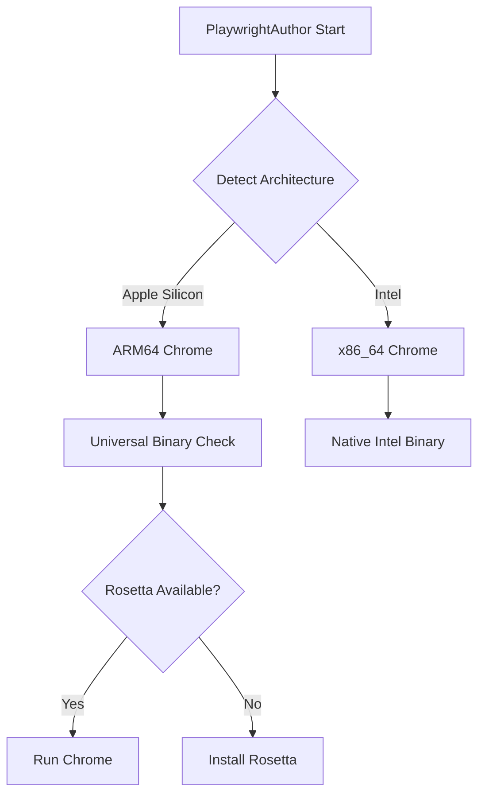

# macOS Platform Guide

This guide explains how to set up, configure, and troubleshoot PlaywrightAuthor on macOS.

## Quick Start

```bash
# Install PlaywrightAuthor
pip install playwrightauthor

# First run - grant permissions when prompted
python -c "from playwrightauthor import Browser; Browser().__enter__()"
```

## Architecture Differences

### Apple Silicon (M1/M2/M3) vs Intel



### Architecture Detection

```python
import platform
import subprocess

def get_mac_architecture():
    """Detect Mac architecture."""
    result = subprocess.run(['uname', '-m'], capture_output=True, text=True)
    arch = result.stdout.strip()
    
    return {
        'arm64': 'Apple Silicon',
        'x86_64': 'Intel'
    }.get(arch, 'Unknown')

print(f"Architecture: {get_mac_architecture()}")

# Architecture-specific Chrome paths
if get_mac_architecture() == 'Apple Silicon':
    chrome_paths = [
        "/Applications/Google Chrome.app",  # Universal binary
        "/Applications/Chrome for Testing.app",
        "/opt/homebrew/bin/chromium"  # Homebrew ARM64
    ]
else:
    chrome_paths = [
        "/Applications/Google Chrome.app",
        "/usr/local/bin/chromium"  # Homebrew Intel
    ]
```

## Security & Permissions

### Required Permissions

macOS requires specific permissions for browser automation:

1. **Accessibility Access**
   - System Preferences → Security & Privacy → Privacy → Accessibility
   - Add Terminal.app or your IDE (VS Code, PyCharm, etc.)

2. **Screen Recording** (for screenshots)
   - System Preferences → Security & Privacy → Privacy → Screen Recording
   - Add Terminal.app or your IDE

3. **Full Disk Access** (optional, for profile access)
   - System Preferences → Security & Privacy → Privacy → Full Disk Access
   - Add Terminal.app or your IDE

### Permission Management

```python
import subprocess
import os

def request_accessibility_permission():
    """Request accessibility permissions on macOS."""
    script = '''
    tell application "System Preferences"
        activate
        reveal anchor "Privacy_Accessibility" of pane "com.apple.preference.security"
    end tell
    '''
    
    subprocess.run(['osascript', '-e', script])
    print("Grant Accessibility access to Terminal/IDE")
    input("Press Enter after granting permission...")

def check_accessibility_permission():
    """Check if accessibility permission is granted."""
    try:
        script = 'tell application "System Events" to get name of first process'
        result = subprocess.run(['osascript', '-e', script], 
                              capture_output=True, text=True)
        return result.returncode == 0
    except:
        return False

if not check_accessibility_permission():
    request_accessibility_permission()
```

### Gatekeeper & Code Signing

macOS Gatekeeper may block unsigned Chrome binaries:

```bash
# Remove quarantine attribute from Chrome
sudo xattr -cr "/Applications/Google Chrome.app"

# Or for Chrome for Testing
sudo xattr -cr "/Applications/Chrome for Testing.app"

# Alternative: Allow in Security preferences
sudo spctl --add --label "Chrome" "/Applications/Google Chrome.app"
sudo spctl --enable --label "Chrome"
```

### Handling Gatekeeper in Python

```python
import subprocess
import os

def remove_quarantine(app_path: str):
    """Remove macOS quarantine attribute."""
    if os.path.exists(app_path):
        try:
            subprocess.run(['xattr', '-cr', app_path], 
                         capture_output=True, check=True)
            print(f"Removed quarantine from {app_path}")
        except subprocess.CalledProcessError:
            print(f"Need sudo to remove quarantine from {app_path}")
            subprocess.run(['sudo', 'xattr', '-cr', app_path])

# Apply to Chrome
remove_quarantine("/Applications/Google Chrome.app")
```

## Homebrew Integration

### Installing Chrome via Homebrew

```bash
# Intel Macs
brew install --cask google-chrome

# Apple Silicon Macs
arch -arm64 brew install --cask google-chrome

# Or use Chromium
brew install chromium
```

### Homebrew Chrome Detection

```python
def find_homebrew_chrome():
    """Find Chrome installed via Homebrew."""
    homebrew_paths = [
        # Apple Silicon
        "/opt/homebrew/Caskroom/google-chrome/latest/Google Chrome.app",
        "/opt/homebrew/bin/chromium",
        # Intel
        "/usr/local/Caskroom/google-chrome/latest/Google Chrome.app",
        "/usr/local/bin/chromium"
    ]
    
    for path in homebrew_paths:
        if os.path.exists(path):
            return path
    
    return None

# Use Homebrew Chrome if available
homebrew_chrome = find_homebrew_chrome()
if homebrew_chrome:
    os.environ['PLAYWRIGHTAUTHOR_CHROME_PATH'] = homebrew_chrome
```

## Display & Graphics

### Retina Display Support

```python
from playwrightauthor import Browser

# High-DPI screenshot support
with Browser(device_scale_factor=2) as browser:
    page = browser.new_page()
    page.goto("https://example.com")
    
    # Take high-resolution screenshot
    page.screenshot(path="retina-screenshot.png")
```

### Multiple Display Handling

```python
import subprocess
import json

def get_display_info():
    """Get macOS display configuration."""
    script = '''
    tell application "System Events"
        set displayList to {}
        repeat with i from 1 to count of desktops
            set end of displayList to {index:i, bounds:(bounds of desktop i)}
        end repeat
        return displayList
    end tell
    '''
    
    result = subprocess.run(['osascript', '-e', script], 
                          capture_output=True, text=True)
    return result.stdout

# Position browser on specific display
with Browser(
    args=[
        '--window-position=1920,0',  # Second monitor
        '--window-size=1280,720'
    ]
) as browser:
    # Browser opens on second display
    pass
```

## Performance Optimization

### macOS-Specific Chrome Flags

```python
# Optimal Chrome flags for macOS
MACOS_CHROME_FLAGS = [
    # Graphics optimization
    '--disable-gpu-sandbox',
    '--enable-accelerated-2d-canvas',
    '--enable-accelerated-video-decode',
    
    # Memory optimization
    '--max_old_space_size=4096',
    '--memory-pressure-off',
    
    # Stability
    '--disable-background-timer-throttling',
    '--disable-renderer-backgrounding',
    
    # macOS specific
    '--disable-features=RendererCodeIntegrity',
    '--disable-smooth-scrolling'  # Better performance
]

with Browser(args=MACOS_CHROME_FLAGS) as browser:
    # Optimized for macOS
    pass
```

### Activity Monitor Integration

```python
import psutil
import subprocess

def get_chrome_metrics():
    """Get Chrome process metrics on macOS."""
    metrics = {
        'processes': [],
        'total_memory_mb': 0,
        'total_cpu_percent': 0
    }
    
    for proc in psutil.process_iter(['pid', 'name', 'memory_info', 'cpu_percent']):
        if 'chrome' in proc.info['name'].lower():
            memory_mb = proc.info['memory_info'].rss / 1024 / 1024
            metrics['processes'].append({
                'pid': proc.info['pid'],
                'memory_mb': round(memory_mb, 2),
                'cpu_percent': proc.info['cpu_percent']
            })
            metrics['total_memory_mb'] += memory_mb
            metrics['total_cpu_percent'] += proc.info['cpu_percent']
    
    return metrics

# Monitor Chrome resource usage
print(json.dumps(get_chrome_metrics(), indent=2))
```

## Troubleshooting

### Common macOS Issues

#### Issue 1: "Chrome.app is damaged"

```bash
# Solution 1: Remove quarantine
sudo xattr -cr "/Applications/Google Chrome.app"

# Solution 2: Re-sign the app
sudo codesign --force --deep --sign - "/Applications/Google Chrome.app"

# Solution 3: Allow in Security preferences
sudo spctl --master-disable  # Temporarily disable Gatekeeper
# Install/run Chrome
sudo spctl --master-enable   # Re-enable Gatekeeper
```

#### Issue 2: Chrome Won't Launch

```python
def diagnose_chrome_launch():
    """Diagnose Chrome launch issues on macOS."""
    checks = []
    
    # Check if Chrome exists
    chrome_path = "/Applications/Google Chrome.app"
    checks.append({
        'check': 'Chrome installed',
        'passed': os.path.exists(chrome_path)
    })
    
    # Check quarantine
    try:
        result = subprocess.run(['xattr', '-l', chrome_path], 
                              capture_output=True, text=True)
        has_quarantine = 'com.apple.quarantine' in result.stdout
        checks.append({
            'check': 'No quarantine flag',
            'passed': not has_quarantine
        })
    except:
        pass
    
    # Check code signature
    try:
        result = subprocess.run(['codesign', '-v', chrome_path], 
                              capture_output=True, text=True)
        checks.append({
            'check': 'Valid code signature',
            'passed': result.returncode == 0
        })
    except:
        pass
    
    # Check accessibility permission
    checks.append({
        'check': 'Accessibility permission',
        'passed': check_accessibility_permission()
    })
    
    # Print results
    print("Chrome Launch Diagnostics:")
    for check in checks:
        status = "✓" if check['passed'] else "✗"
        print(f"{status} {check['check']}")
    
    return all(check['passed'] for check in checks)

# Run diagnostics
if not diagnose_chrome_launch():
    print("\nFix the issues above before proceeding")
```

#### Issue 3: Slow Performance

```python
# Clear Chrome cache and temporary files
def clear_chrome_cache():
    """Clear Chrome cache on macOS."""
    cache_paths = [
        "~/Library/Caches/Google/Chrome",
        "~/Library/Caches/com.google.Chrome",
        "~/Library/Application Support/Google/Chrome/Default/Cache"
    ]
    
    for path in cache_paths:
        expanded_path = os.path.expanduser(path)
        if os.path.exists(expanded_path):
            try:
                shutil.rmtree(expanded_path)
                print(f"Cleared {path}")
            except Exception as e:
                print(f"Could not clear {path}: {e}")
```

### System Integration

#### LaunchAgents for Background Operation

Create `~/Library/LaunchAgents/com.playwrightauthor.chrome.plist`:

```xml
<?xml version="1.0" encoding="UTF-8"?>
<!DOCTYPE plist PUBLIC "-//Apple//DTD PLIST 1.0//EN" 
  "http://www.apple.com/DTDs/PropertyList-1.0.dtd">
<plist version="1.0">
<dict>
    <key>Label</key>
    <string>com.playwrightauthor.chrome</string>
    <key>ProgramArguments</key>
    <array>
        <string>/Applications/Google Chrome.app/Contents/MacOS/Google Chrome</string>
        <string>--remote-debugging-port=9222</string>
        <string>--user-data-dir=/Users/YOUR_USERNAME/Library/Application Support/playwrightauthor/profiles/default</string>
        <string>--no-first-run</string>
        <string>--no-default-browser-check</string>
    </array>
    <key>RunAtLoad</key>
    <true/>
    <key>KeepAlive</key>
    <true/>
</dict>
</plist>
```

Load with:
```bash
launchctl load ~/Library/LaunchAgents/com.playwrightauthor.chrome.plist
```

## Security Best Practices

1. **Use macOS Keychain for Credentials**
   ```python
   import subprocess
   
   def save_to_keychain(service: str, account: str, password: str):
       """Save credentials to macOS Keychain."""
       subprocess.run([
           'security', 'add-generic-password',
           '-s', service,
           '-a', account,
           '-w', password,
           '-U'  # Update if exists
       ])
   
   def get_from_keychain(service: str, account: str) -> str:
       """Retrieve password from macOS Keychain."""
       result = subprocess.run([
           'security', 'find-generic-password',
           '-s', service,
           '-a', account,
           '-w'
       ], capture_output=True, text=True)
       
       return result.stdout.strip() if result.returncode == 0 else None
   ```

2. **Sandboxing Chrome**
   ```python
   # Run Chrome with enhanced sandboxing
   with Browser(args=[
       '--enable-sandbox',
       '--disable-setuid-sandbox',  # Not needed on macOS
       '--enable-features=NetworkService,NetworkServiceInProcess'
   ]) as browser:
       pass
   ```

3. **Privacy Settings**
   - Disable location services for Chrome
   - Disable camera/microphone access unless needed
   - Use separate profiles for different security contexts

## Additional Resources

- [Apple Developer - Security](https://developer.apple.com/security/)
- [Chrome Enterprise on macOS](https://support.google.com/chrome/a/answer/7550274)
- [macOS Security Guide](https://support.apple.com/guide/security/welcome/web)
- [Homebrew Chrome Formula](https://formulae.brew.sh/cask/google-chrome)